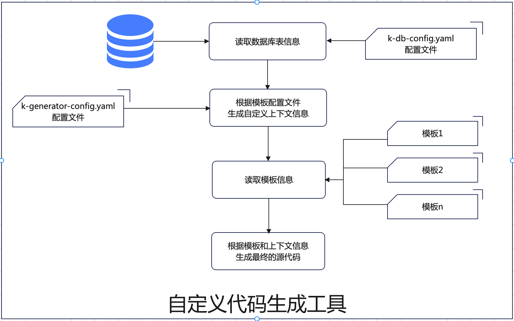

# code generator

### Description

A code generator

### Software Architecture



read table info using jdbc,to generate source code。

### Installation

####1、build and publish to local

```
        gradle clean build publishToMavenLocal-x test
```

#### 2、gradle (gradle.org)

```

        implementation 'io.github.kylin-hunter:k-code-generator:1.0.4'
         //The latest version can be found in the Maven repository 

```

#### 3、maven (maven.apache.org)

```

        <dependency>
          <groupId>io.github.kylin-hunter</groupId>
          <artifactId>k-code-generator</artifactId>
          <version>1.0.4</version> //The latest version can be found in the Maven repository 
        </dependency>

```

### Instructions

#### 1. create a table
```

CREATE TABLE IF NOT EXISTS `test_user`(
        `id`                  bigint(20)     NOT NULL COMMENT 'primary unique id' AUTO_INCREMENT,
        `name`                varchar(64)    NOT NULL DEFAULT '' COMMENT 'user name ',
        `birth`               datetime       NOT NULL DEFAULT CURRENT_TIMESTAMP COMMENT 'birthday',
        `leave_company_time`  timestamp      NOT NULL COMMENT 'the time leave company',
        `join_company_date`   date           NOT NULL COMMENT 'what time to join the company',
        `work_time_work_time` time           NOT NULL COMMENT 'what time to work ervery moring',
        `work_hours`          int            NOT NULL DEFAULT 0 COMMENT 'how many hours to work everyday',
        `age`                 smallint       NOT NULL DEFAULT 0 COMMENT 'age',
        `height`              float(9, 2)    NOT NULL DEFAULT 0 COMMENT 'height',
        `weight`              double(19, 2)  NOT NULL DEFAULT 0 COMMENT 'weight',
        `money_income`        decimal(20, 2) NOT NULL DEFAULT 0 COMMENT 'all money income',
        `money_spend`         decimal(19, 0) NOT NULL DEFAULT 0 COMMENT 'the money spent',
        `address`             varchar(512)   NOT NULL DEFAULT 0 COMMENT 'address',
        `delete_flag`         tinyint(1)     NOT NULL DEFAULT 0 COMMENT 'is deleted',
        `sex`                 tinyint(2)     NOT NULL DEFAULT 0 COMMENT '0 unkown 1 male 2 female',
        `role_id`             bigint(20)     NOT NULL DEFAULT 0 COMMENT '角色 ID',
        `extend_1`            varchar(256)   NOT NULL DEFAULT 0 COMMENT '预留字段1',
        `extend_2`            varchar(256)   NOT NULL DEFAULT 0 COMMENT '预留字段2',
        `extend_3`            varchar(256)   NOT NULL DEFAULT 0 COMMENT '预留字段3',
        PRIMARY KEY (`id`),
        constraint test_user_role_fk
        foreign key (role_id) references test_role (id)
) comment ='the user'


```

#### 2. create database  config file for connection 

##### 2.1  k-db-config.yaml (put it to classpath)

```

datasources:
  - driverClassName: 'com.mysql.cj.jdbc.Driver'
    url: 'jdbc:mysql://localhost:3306/kp?useUnicode=true&characterEncoding=utf8&useSSL=false&allowPublicKeyRetrieval=true&allowMultiQueries=true&serverTimezone=Asia/Shanghai'
    username: 'root'
    password: 'root'
    pool:
      minimumIdle: 1
      maximumPoolSize: 10
      connectionTimeout: 30000 # default 30000
      idleTimeout: 600000 # default: 600000 (10 minutes)
      maxLifetime: 1800000  # default: 1800000 (30 minutes
      validationTimeout: 5000 # default: 5000
    properties:
      cachePrepStmts: true
      prepStmtCacheSize: 250
      prepStmtCacheSqlLimit: 2048
```

#### 3.  create a template config file 
##### 3.1 k-generator-config.yaml (put it to classpath)

```
global: # global config
  template_path: '/User/bijian/template'   # template dir,can use current dir: $user.dir$/templates
  output:
    path: '/User/bijian/output'   # output dir,can use current dir: $user.dir$/output
    auto_clean: true # auto clean the output path
    auto_create: true # create the output path if not exists
        
modules:
  database:
    name: "kp"
    sql_types: #  custom sql  type
      "datetime": "java.time.LocalTime"  # column declared datetime, is specially marked as java.time.LocalTime
      "smallint": "java.lang.Short"  # column declared smallint, is specially marked as java.lang.Short
      "(type=='decimal' && size<=19 && precision==0)": "java.lang.Long"
      # column declared decimal(size<=19,precision==0), is marked as java.lang.Longe.g. decimal(10,0) = java.lang.Long  
  list:
    - name: 'User' # module name
      context:
        'module_custom_propery': 'module_custom_propery_value'  # a module vairable 
      table:
        name: "test_user" #table name
        skip_columns: #  skip some columns
          - 'delete_flag'
          - 'extend_1'
          - 'extend_2'
          - 'extend_3'
        column_types: # override the default sql type
        "role_id": "java.lang.Integer"  # role_id  is specially marked as type java.lang.Integer
    - name: 'Role' # the second module
      table:
        name: 'test_role'
templates: # tempalte definition
  context:
    'author': 'bijian'  # tempalte variable 
  strategy: # 
    template_encoding: UTF-8 # template encoding
    output_encoding: UTF-8 # output file encoding
  list:
    - name: basic.vm  #template name
      enabled: true
      context:
        'basic_vm_custom_property': 'basic_vm_custom_property_value'  #  template vairable
      strategy:
        package_name: '"com.kylinhunter."+k.str_lower(module.name)' #package name
        class_name: k.str_camel(module.name,'upper')+'Basic' #class name
        super_class: 'java.util.ArrayList' # super class
        interfaces:  # the interfaces
          - java.io.Serializable
          - java.lang.Cloneable
        extension: 'java' #  a  file  with extension *.java
    - name: basic_swagger.vm # the sencond template  basic_swagger.vm
      enabled: true
      context:
        'basic_swagger_vm_custom_property': 'basic_swagger_vm_custom_property_value'  # template vairable
      strategy:
        package_name: '"com.kylinhunter."+k.str_lower(module.name)' #package name
        class_name: k.str_camel(module.name,'upper')+'BasicSwagger' #class name
        super_class: 'java.util.ArrayList'  # super class
        interfaces: # the interfaces
          - java.io.Serializable
          - java.lang.Cloneable
        extension: 'java'  #  a  file  with extension *.java
    - name: basic_swagger_snippet.vm # the third template  basic_swagger_snippet.vm
      enabled: true 
      context:
        'basic_swagger_snippet_vm_custom_property': 'basic_swagger_snippet_vm_custom_property_value'  # template vairable
      strategy:
        package_name: '"com.kylinhunter."+k.str_lower(module.name)' #package name
        class_name: k.str_camel(module.name,'upper')+'BasicSwaggerSnippet' #class name
        super_class: 'java.util.ArrayList'  # super class
        interfaces:# the interfaces
          - java.io.Serializable
          - java.lang.Cloneable
        extension: 'java'  # a  file  with extension *.java
```


#### 4.   the syntax of the template and  usage

> tempalte syntax reference volecity

##### 4.1 basic  usage


| example      | explain|
| ------------- | -------------|
| ${class.packageName} |output pakageName|
| ${class.name} | output class simple name|
| ${class.imports("import ",";")} | output imports  start with import,end with; <br>Abbreviated as ${class.imports}|
| $!{class.comment}  | output comment of the class , the table's remarks|
| ${class.superClass("extends ")} | output superclass ,start with 'extends' ,<br>Abbreviated as ${class.superClass}|
| ${class.interfaces("implements ")}  | output all interfaces ,start with 'implements'，<br>Abbreviated as ${class.interfaces}|
| #foreach($field in ${class.fields}) <br>&nbsp;&nbsp;${field.comment}<br>&nbsp;&nbsp;${field.type}<br>&nbsp;&nbsp;${field.name}<br>#end  |<li>${class.fields} => Traverse all fields<br><li>${field.comment}=>the comment of field from the table column's remarks <br><li>${field.type}==>the type of field ,for example String  Long<br><li>${field.name}==>the name of field from the table column with camel style|
| #call($class.imports.add("io.swagger.annotations.ApiModel"))  | add a class to imports|
| #call($class.snippets.add("class_before","xxx")) |add a  code Snippet with name 'class_before'|
| ${class.snippets('class_before')} |output the code Snippet with name 'class_before'|


##### 4.2 velocity GenericTools
```
you can use velocity GenericTools in the template
official website reference: https://velocity.apache.org/tools/devel/generic.html
the default configuration location: io/github/kylinhunter/commons/template/velocity-tools.xml（k-commons.jar)

<tools>
  <toolbox scope="application">
    <tool class="org.apache.velocity.tools.generic.DateTool" format="yyyy-MM-dd"></tool>
    <tool class="org.apache.velocity.tools.generic.NumberTool"></tool>
    <tool class="org.apache.velocity.tools.generic.MathTool"></tool>
    <tool class="org.apache.velocity.tools.generic.DisplayTool"></tool>
    <tool class="org.apache.velocity.tools.generic.EscapeTool"></tool>
    <tool class="org.apache.velocity.tools.generic.FieldTool"></tool>
  </toolbox>
</tools>
        
// for examples:
${date}=>output a date

```

##### 4.3 custom variable

 you have three positions to define your custom variable in k-generator-config.yaml above
 1. modules.list[x].context
 2. templates.context
 3. templates.list[x].context

```

for examples:
templates:
  context:
    'author': 'bijian'  #  define a variable autho
${author}=>output the variable author

```

#### 5 example1  basic tempalte


##### 5.1 difine template basic.vm

```
package ${class.packageName};
${class.imports("import ",";")}
 /**
  * @description  $!{class.comment}
  * @author ${author}
  * @since ${date}
  * ${basic_vm_custom_property}
  * ${module_custom_propery}
  **/
 public class ${class.name} ${class.superClass("extends ")} ${class.interfaces("implements ")}{
#foreach($field in ${class.fields})
 private ${field.type} ${field.name}; // ${field.comment}
#end
}


```

##### 5.2 exec

```
new CodeGenerator().execute();
```

##### 5.3 the file generated

```
package com.kylinhunter.user;
import java.util.ArrayList;
import java.io.Serializable;
import java.time.LocalTime;
import java.sql.Timestamp;
import java.sql.Date;
import java.sql.Time;
import java.math.BigDecimal;
/**
 * @description  the user
 * @author bijian
 * @since 2023-02-28
 * basic_vm_custom_property_value
 **/
public class UserBasic extends ArrayList implements Serializable,Cloneable{
    private Long id; // primary unique id
    private String name; // user name
    private LocalTime birth; // birthday
    private Timestamp leaveCompanyTime; // the time leave company
    private Date joinCompanyDate; // what time to join the company
    private Time workTimeWorkTime; // what time to work ervery moring
    private Integer workHours; // how many hours to work everyday
    private Short age; // age
    private Float height; // height
    private Double weight; // weight
    private BigDecimal moneyIncome; // all money income
    private Long moneySpend; // the money spent
    private String address; // address
    private Boolean deleteFlag; // is deleted
    private Integer sex; // 0 unkown 1 male 2 female
    private Integer roleId; // 角色 ID
}


```

#### 6 example2 （add swagger）


##### 6.1 define basic_swagger.vm 

```
package ${class.packageName};
${class.imports("import ",";")}
import io.swagger.annotations.ApiModel;
import io.swagger.annotations.ApiModelProperty;

/**
 * @description  $!{class.comment}
 * @author ${author}
 * @since ${date}
 * ${basic_swagger_vm_custom_property}
 * ${module_custom_propery}
 **/
@ApiModel(value="${class.name}", description="$!{class.comment}")
public class ${class.name} ${class.superClass("extends ")} ${class.interfaces("implements ")}{
#foreach($field in ${class.fields})
@ApiModelProperty(value = "${field.comment}")
    private ${field.type} ${field.name};
#end
}


```

##### 6.2 exec

```
new CodeGenerator().execute();
```

##### 6.3 the file generated

```
package com.kylinhunter.user;
import java.util.ArrayList;
import java.io.Serializable;
import java.time.LocalTime;
import java.sql.Timestamp;
import java.sql.Date;
import java.sql.Time;
import java.math.BigDecimal;
import io.swagger.annotations.ApiModel;
import io.swagger.annotations.ApiModelProperty;

/**
 * @description  the user
 * @author bijian
 * @since 2023-02-28
 * basic_swagger_vm_custom_property_value
 **/
@ApiModel(value="UserBasicSwagger", description="the user")
public class UserBasicSwagger extends ArrayList implements Serializable,Cloneable{
    @ApiModelProperty(value = "primary unique id")
    private Long id;
    @ApiModelProperty(value = "user name")
    private String name;
    @ApiModelProperty(value = "birthday")
    private LocalTime birth;
    @ApiModelProperty(value = "the time leave company")
    private Timestamp leaveCompanyTime;
    @ApiModelProperty(value = "what time to join the company")
    private Date joinCompanyDate;
    @ApiModelProperty(value = "what time to work ervery moring")
    private Time workTimeWorkTime;
    @ApiModelProperty(value = "how many hours to work everyday")
    private Integer workHours;
    @ApiModelProperty(value = "age")
    private Short age;
    @ApiModelProperty(value = "height")
    private Float height;
    @ApiModelProperty(value = "weight")
    private Double weight;
    @ApiModelProperty(value = "all money income")
    private BigDecimal moneyIncome;
    @ApiModelProperty(value = "the money spent")
    private Long moneySpend;
    @ApiModelProperty(value = "address")
    private String address;
    @ApiModelProperty(value = "is deleted")
    private Boolean deleteFlag;
    @ApiModelProperty(value = "0 unkown 1 male 2 female")
    private Integer sex;
    @ApiModelProperty(value = "角色 ID")
    private Integer roleId;
}


```


#### 7 example3 （add swagger ,using snippets）


##### 7.1 define a code snippet tempalte： swagger.vm

```

#parse("io/github/kylinhunter/commons/generator/common.vm")
##add  package import
#call($class.imports.add("io.swagger.annotations.ApiModel"))
#call($class.imports.add("io.swagger.annotations.ApiModelProperty"))
##  define a snippet named 'class_before'
#set( $classAnnotation ='@ApiModel(value="'+${class.name}+'", description="'+$!{class.comment}+'")' )
#call($class.snippets.add("class_before",$classAnnotation))
#foreach($field in ${class.fields})
#set( $fieldAnnotation =  '@ApiModelProperty(value = "'+${field.comment}+'")')
##define a snippet named 'field_before'
#call($field.snippets.add("field_before",$fieldAnnotation) )
#end


```
##### 7.2 define basic_swagger_snippet.vm , using swagger.vm

```

#parse("commons/swagger.vm")
package ${class.packageName};
${class.imports("import ",";")}

/**
* @description  $!{class.comment}
* @author ${author}
* @since ${date}
* ${basic_swagger_snippet_vm_custom_property}
* ${module_custom_propery}
**/
${class.snippets('class_before')}
public class ${class.name} ${class.superClass("extends ")} ${class.interfaces("implements ")}{
#foreach($field in ${class.fields})
    ${field.snippets('field_before')}
    private ${field.type} ${field.name};
#end

}


```

##### 7.3 exec

```
new CodeGenerator().execute();
```

##### 7.4 the file generated

```
package com.kylinhunter.user;
import java.util.ArrayList;
import java.io.Serializable;
import java.time.LocalTime;
import java.sql.Timestamp;
import java.sql.Date;
import java.sql.Time;
import java.math.BigDecimal;
import io.swagger.annotations.ApiModel;
import io.swagger.annotations.ApiModelProperty;

/**
 * @description  the user
 * @author bijian
 * @since 2023-02-28
 * basic_swagger_snippet_vm_custom_property_value
 **/
@ApiModel(value="UserBasicSwaggerSnippet", description="the user")
public class UserBasicSwaggerSnippet extends ArrayList implements Serializable,Cloneable{
    @ApiModelProperty(value = "primary unique id")
    private Long id;
    @ApiModelProperty(value = "user name")
    private String name;
    @ApiModelProperty(value = "birthday")
    private LocalTime birth;
    @ApiModelProperty(value = "the time leave company")
    private Timestamp leaveCompanyTime;
    @ApiModelProperty(value = "what time to join the company")
    private Date joinCompanyDate;
    @ApiModelProperty(value = "what time to work ervery moring")
    private Time workTimeWorkTime;
    @ApiModelProperty(value = "how many hours to work everyday")
    private Integer workHours;
    @ApiModelProperty(value = "age")
    private Short age;
    @ApiModelProperty(value = "height")
    private Float height;
    @ApiModelProperty(value = "weight")
    private Double weight;
    @ApiModelProperty(value = "all money income")
    private BigDecimal moneyIncome;
    @ApiModelProperty(value = "the money spent")
    private Long moneySpend;
    @ApiModelProperty(value = "address")
    private String address;
    @ApiModelProperty(value = "is deleted")
    private Boolean deleteFlag;
    @ApiModelProperty(value = "0 unkown 1 male 2 female")
    private Integer sex;
    @ApiModelProperty(value = "角色 ID")
    private Integer roleId;

}


```


#### License

[Apache License 2.0](https://www.apache.org/licenses/LICENSE-2.0)
