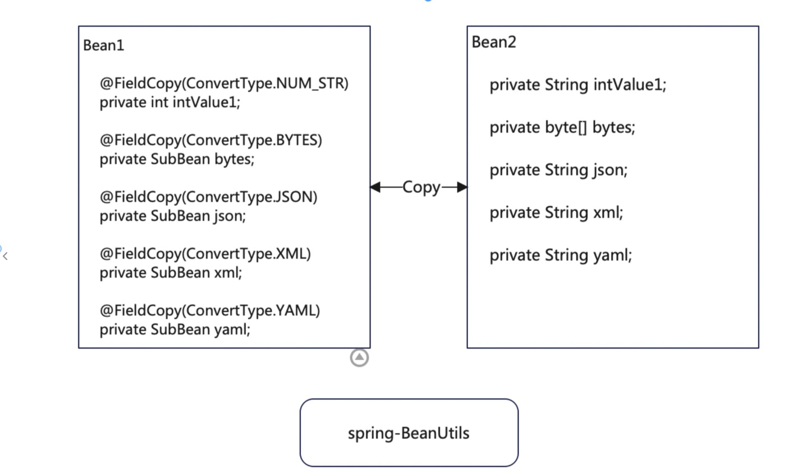

# bit state

### Description



A bean copy util  based on spring BeanUtil

### design specification

A bean copy util  based on spring BeanUtil

### Installation

####1、build and publish to local

```
        gradle clean build publishToMavenLocal-x test
```

#### Optional  Dependencies (gradle.org)

```
        implementation 'org.yaml:snakeyaml:1.29' // support yaml , if needed
        implementation 'org.dom4j:dom4j:2.1.3' // support xml, if needed

```

####  Optional  Dependencies  (maven.apache.org)

```
        <dependency>  <!-- support yaml , if needed-->
          <groupId>org.yaml</groupId>
          <artifactId>snakeyaml</artifactId>
          <version>1.29</version>
        </dependency>
        <dependency> <!-- support xml , if needed-->
          <groupId>org.dom4j</groupId>
          <artifactId>dom4j</artifactId>
          <version>2.1.3</version>
        </dependency>

```

### Instructions

#### 1. manage the enum sates 

##### 1.1 api

```

/**
 * @param source           the source bean
 * @param target           the target bean
 * @param ignoreProperties array of property names to ignore
 * @return void
 * @title copyProperties
 * @description Copy the property values of the given source bean into the given target bean
 * @author BiJi'an
 * @date 2021/8/13 8:52 下午
 */
public static void copyProperties(Object source, Object target, String... ignoreProperties)

```

##### 1.2 exampe 1


###### 1.2.1 code

```java

@Data
public class Bean1 {

    private String name;

    private String nameIgnore;

    @FieldCopy(ConvertType.NUM_STR) // Supports conversion between numbers and strings
    private int intValue1;

    @FieldCopy(ConvertType.BYTES) // Supports conversion between object and byte array
    private SubBean bytes;

    @FieldCopy(ConvertType.JSON) // Supports conversion between object and json strings
    private SubBean json;

    @FieldCopy(ConvertType.XML)  // Supports conversion between object and xml strings
    private SubBean xml;

    @FieldCopy(ConvertType.YAML) // Supports conversion between object and yaml strings
    private SubBean yaml;

}

@Data
public class Bean2 {
    private String name;
    private String nameIgnore;
    private String intValue1;
    private byte[] bytes;
    private String json;
    private String xml;
    private String yaml;

}

@XmlRootElement
@Data
public class SubBean implements Serializable {
    private int id;
    private String text;
}


class BeanCopyUtilsTest {
    public static void main(String[] args) {

        SubBean subBean = new SubBean();
        subBean.setId(99);
        subBean.setText("text");

        Bean1 bean1 = new Bean1();
        bean1.setName("name");
        bean1.setNameIgnore("nameIgnore");
        bean1.setIntValue1(1);
        bean1.setBytes(subBean);
        bean1.setJson(subBean);
        bean1.setXml(subBean);
        bean1.setYaml(subBean);

        Bean2 bean2 = new Bean2();
        BeanCopyUtils.copyProperties(bean1, bean2, "nameIgnore");
        System.out.println("name=>" + bean2.getName());
        System.out.println("nameIgnore=>" + bean2.getNameIgnore());
        System.out.println("intValue1=>" + bean2.getIntValue1());
        System.out.println("bytes=>" + Arrays.toString(bean2.getBytes()));
        System.out.println("json=>" + bean2.getJson());
        System.out.println("xml=>" + bean2.getXml());
        System.out.println("yaml=>" + bean2.getYaml());

        Bean1 bean1Reverse = new Bean1();
        bean2.setNameIgnore("name2");
        BeanCopyUtils.copyProperties(bean2, bean1Reverse);

        System.out.println("name=>" + bean1Reverse.getName());
        System.out.println("nameIgnore=>" + bean1Reverse.getNameIgnore());
        System.out.println("intValue1=>" + bean1Reverse.getIntValue1());
        System.out.println("bytes=>" + bean1Reverse.getBytes());
        System.out.println("json=>" + bean1Reverse.getJson());
        System.out.println("xml=>" + bean1Reverse.getXml());
        System.out.println("yaml=>" + bean1Reverse.getYaml());

    }

}
       
```

###### 1.2.2 print result

```

        name=>name
        nameIgnore=>null
        intValue1=>1
        bytes=>[-84, -19, 0, 5, 115, 114, 0, 42, 105, 111, 46, 103, 105, 116, 104, 117, 98, 46, 107, 121, 108, 105, 110, 104, 117, 110, 116, 101, 114, 46, 99, 111, 109, 109, 111, 110, 115, 46, 98, 101, 97, 110, 46, 83, 117, 98, 66, 101, 97, 110, -9, -93, 3, 11, -8, 96, 40, 82, 2, 0, 2, 73, 0, 2, 105, 100, 76, 0, 4, 116, 101, 120, 116, 116, 0, 18, 76, 106, 97, 118, 97, 47, 108, 97, 110, 103, 47, 83, 116, 114, 105, 110, 103, 59, 120, 112, 0, 0, 0, 99, 116, 0, 4, 116, 101, 120, 116]
        json=>{"id":99,"text":"text"}
        xml=><?xml version="1.0" encoding="UTF-8" standalone="yes"?><subBean><id>99</id><text>text</text></subBean>
        yaml=>id: 99
        text: text

        name=>name
        nameIgnore=>name2
        intValue1=>1
        bytes=>SubBean(id=99, text=text)
        json=>SubBean(id=99, text=text)
        xml=>SubBean(id=99, text=text)
        yaml=>SubBean(id=99, text=text)

```


### copyright | License

[Apache License 2.0](https://www.apache.org/licenses/LICENSE-2.0)
