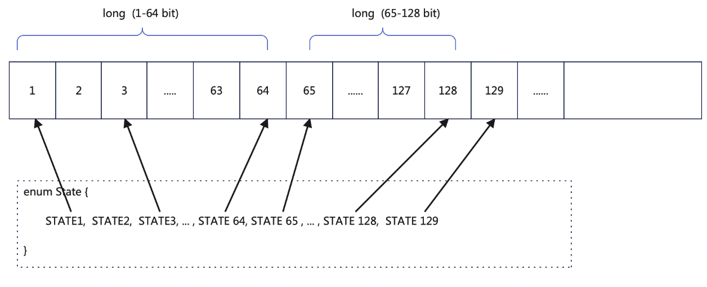

# bit state

### 介绍

一个基于位运算的状态管理工具

### 设计说明



利用位运算，以及java的枚举类型，管理状态


### 使用说明

#### 1.  枚举状态管理

##### 1.1 api

```


/**
 * @param states 枚举状态
 * @return void
 * @title 设置枚举状态 
 * @description
 * @author BiJi'an
 * @date 2022-12-09 00:35
 */
@SafeVarargs
public final void setState(E... states) ;

/**
 * @param states   枚举状态
 * @return void
 * @title removeState 清空指定的枚举状态
 * @description
 * @author BiJi'an
 * @date 2022-12-08 16:46
 */
@SafeVarargs
public final void removeState(E... states) ;

/**
 * @param states 枚举状态
 * @return boolean
 * @title hasStatus 枚举状态是否存在
 * @description
 * @author BiJi'an
 * @date 2022-12-08 16:46
 */
@SafeVarargs
public final boolean hasState(E... states)

```

##### 1.2 示例1


###### 1.2.1 代码

```

    // 定义一个基于枚举类型的状态
    public enum TestState {
        STATE1,
        STATE2,
        STATE3
    }

    // 继承 io.github.kylinhunter.commons.state.AbstractBitState 类
    public static class TestStateBitState extends AbstractBitState<TestState> {

    }
    // 测试用例
    TestStateBitState stateBitState = new TestStateBitState();
    stateBitState.setState(TestState.STATE1);
    System.out.println(stateBitState);
    assertTrue(stateBitState.hasState(TestState.STATE1));
    assertFalse(stateBitState.hasState(TestState.STATE2));
    assertFalse(stateBitState.hasState(TestState.STATE3));

    stateBitState.setState(TestState.STATE2);
    System.out.println(stateBitState);
    assertTrue(stateBitState.hasState(TestState.STATE1));
    assertTrue(stateBitState.hasState(TestState.STATE2));
    assertFalse(stateBitState.hasState(TestState.STATE3));

    stateBitState.setState(TestState.STATE3);
    System.out.println(stateBitState);
    assertTrue(stateBitState.hasState(TestState.STATE1));
    assertTrue(stateBitState.hasState(TestState.STATE2));
    assertTrue(stateBitState.hasState(TestState.STATE3));

    stateBitState.removeState(TestState.STATE3, TestState.STATE1);
    System.out.println(stateBitState);

    assertFalse(stateBitState.hasState(TestState.STATE1));
    assertTrue(stateBitState.hasState(TestState.STATE2));
    assertFalse(stateBitState.hasState(TestState.STATE3));
       
```

###### 1.2.2 打印结果

```
    AbstractBitState[bitStates[0]=1]
    AbstractBitState[bitStates[0]=11]
    AbstractBitState[bitStates[0]=111]
    AbstractBitState[bitStates[0]=10]

```

##### 1.3 示例2

###### 1.3.1 代码

```

    // 定义一个基于枚举类型的状态 65个状态
    public enum TestState2 {
        STATE1,
        STATE2,
        STATE3,
        STATE4,
        STATE5,
        STATE6,
        STATE7,
        STATE8,
        STATE9,
        STATE10,
        STATE11,
        STATE12,
        STATE13,
        STATE14,
        STATE15,
        STATE16,
        STATE17,
        STATE18,
        STATE19,
        STATE20,
        STATE21,
        STATE22,
        STATE23,
        STATE24,
        STATE25,
        STATE26,
        STATE27,
        STATE28,
        STATE29,
        STATE30,
        STATE31,
        STATE32,
        STATE33,
        STATE34,
        STATE35,
        STATE36,
        STATE37,
        STATE38,
        STATE39,
        STATE40,
        STATE41,
        STATE42,
        STATE43,
        STATE44,
        STATE45,
        STATE46,
        STATE47,
        STATE48,
        STATE49,
        STATE50,
        STATE51,
        STATE52,
        STATE53,
        STATE54,
        STATE55,
        STATE56,
        STATE57,
        STATE58,
        STATE59,
        STATE60,
        STATE61,
        STATE62,
        STATE63,
        STATE64,
        STATE65
    }

    // 继承 io.github.kylinhunter.commons.state.AbstractBitState 类
    public static class TestStateBitState2 extends AbstractBitState<TestState> {

    }

    TestStateBitState2 stateBitState = new TestStateBitState2();
    stateBitState.setState(TestState2.STATE1);
    stateBitState.setState(TestState2.STATE63);
    System.out.println(stateBitState);
    assertTrue(stateBitState.hasState(TestState2.STATE1));
    assertFalse(stateBitState.hasState(TestState2.STATE2));
    assertFalse(stateBitState.hasState(TestState2.STATE3));

    assertTrue(stateBitState.hasState(TestState2.STATE63));
    assertFalse(stateBitState.hasState(TestState2.STATE64));
    assertFalse(stateBitState.hasState(TestState2.STATE65));

    stateBitState.setState(TestState2.STATE2);
    stateBitState.setState(TestState2.STATE64);
    System.out.println(stateBitState);
    assertTrue(stateBitState.hasState(TestState2.STATE1));
    assertTrue(stateBitState.hasState(TestState2.STATE2));
    assertFalse(stateBitState.hasState(TestState2.STATE3));
    assertTrue(stateBitState.hasState(TestState2.STATE63));
    assertTrue(stateBitState.hasState(TestState2.STATE64));
    assertFalse(stateBitState.hasState(TestState2.STATE65));

    stateBitState.setState(TestState2.STATE3);
    stateBitState.setState(TestState2.STATE65);
    System.out.println(stateBitState);
    assertTrue(stateBitState.hasState(TestState2.STATE1));
    assertTrue(stateBitState.hasState(TestState2.STATE2));
    assertTrue(stateBitState.hasState(TestState2.STATE3));
    assertTrue(stateBitState.hasState(TestState2.STATE63));
    assertTrue(stateBitState.hasState(TestState2.STATE64));
    assertTrue(stateBitState.hasState(TestState2.STATE65));

    stateBitState.removeState(TestState2.STATE1, TestState2.STATE3,TestState2.STATE63,TestState2.STATE65);
    System.out.println(stateBitState);

    assertFalse(stateBitState.hasState(TestState2.STATE1));
    assertTrue(stateBitState.hasState(TestState2.STATE2));
    assertFalse(stateBitState.hasState(TestState2.STATE3));

    assertFalse(stateBitState.hasState(TestState2.STATE63));
    assertTrue(stateBitState.hasState(TestState2.STATE64));
    assertFalse(stateBitState.hasState(TestState2.STATE65));
       
```

###### 1.3.2 打印结果

```
    AbstractBitState[bitStates[0]=100000000000000000000000000000000000000000000000000000000000001, bitStates[1]=0]
    AbstractBitState[bitStates[0]=1100000000000000000000000000000000000000000000000000000000000011, bitStates[1]=0]
    AbstractBitState[bitStates[0]=1100000000000000000000000000000000000000000000000000000000000111, bitStates[1]=1]
    AbstractBitState[bitStates[0]=1000000000000000000000000000000000000000000000000000000000000010, bitStates[1]=0]

```

### 版权 | License

[Apache License 2.0](https://www.apache.org/licenses/LICENSE-2.0)
