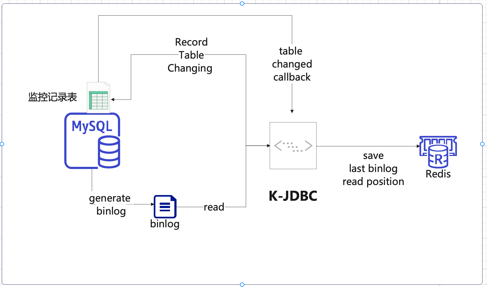

# binlog-table-monitor

### 介绍

> 一个基于binlog-connector-java和redis的表监控工具。

实现的功能包括:
1. 监控表的变化记录到特定记录表中
2. 根据表的变化，提供回调函数

### 设计说明



1. 利用 mysql-binlog-connector-java工具包，读取mysql的binlog
2. 读取过的位置记录在redis中，下次启动时，从redis中读取上次的位置
3. 被监控的表的变化，会被记录存储在一个或者几个固定的记录表中，表结构如下：
```
   CREATE TABLE IF NOT EXISTS `k_junit_table_monitor_binlog`
   (
   `db`               varchar(64) NOT NULL COMMENT 'database',
   `table_name`       varchar(64) NOT NULL COMMENT 'table-name',
   `sys_auto_updated` datetime    NOT NULL DEFAULT CURRENT_TIMESTAMP ON UPDATE CURRENT_TIMESTAMP COMMENT 'sys update time',
   `data_id`          varchar(64) NOT NULL COMMENT 'data_id',
   `retry_times`      tinyint     NOT NULL DEFAULT 0 COMMENT 'retry times',
   `op`               tinyint     NOT NULL DEFAULT 0 COMMENT '1、insert 2、update 3、delete',
   `status`           tinyint(4)  NOT NULL DEFAULT 0 COMMENT '0 wait，1 processing，2 success，3、retrying，4、error',
   PRIMARY KEY (`db`, `table_name`, `data_id`)
   );
```

4. 监控表的变化，会触发回调函数，需要用户自己实现 ExecCallback 接口

### 安装教程

#### 依赖说明（gradle.org）

```
    // mysql 驱动
    implementation("mysql:mysql-connector-java")
    // 读取binlog的工具包
    implementation 'com.zendesk:mysql-binlog-connector-java'
    // redis 驱动 用以存储binlog的记录的暂存点
    implementation 'io.lettuce:lettuce-core'
    // json 用以存储json在redis中的序列化
    implementation("com.fasterxml.jackson.core:jackson-databind")
    implementation("com.fasterxml.jackson.datatype:jackson-datatype-jsr310")

```


### 使用说明

#### 测试前准备监控的表

```

CREATE TABLE IF NOT EXISTS `k_junit_jdbc_role1`
(
    `id`                    varchar(64)  NOT NULL COMMENT '主键',
    `sys_tenant_id`         varchar(64)  NOT NULL DEFAULT '' COMMENT '租户ID',
    `sys_auto_updated`      datetime     NOT NULL DEFAULT CURRENT_TIMESTAMP ON UPDATE CURRENT_TIMESTAMP COMMENT '系统更新时间',
    `sys_created_user_id`   varchar(64)  NOT NULL default 0 COMMENT '创建人userid',
    `sys_created_user_name` varchar(64)  NOT NULL default '' COMMENT '创建人username',
    `sys_created_time`      datetime     NOT NULL DEFAULT CURRENT_TIMESTAMP COMMENT '创建时间',
    `sys_update_user_id`    varchar(64)  NOT NULL default 0 COMMENT '最后编辑人userid',
    `sys_update_user_name`  varchar(64)  NOT NULL default '' COMMENT '最后编辑人username',
    `sys_update_time`       datetime     NOT NULL DEFAULT CURRENT_TIMESTAMP COMMENT '最后编辑时间',
    `sys_delete_flag`       tinyint      NOT NULL DEFAULT 0 COMMENT '0 未删除 1删除',
    `sys_op_lock`           int          NULL DEFAULT 0 COMMENT '乐观锁',
    `code`                  varchar(64)  NOT NULL DEFAULT '' COMMENT 'code',
    `name`                  varchar(64)  NOT NULL DEFAULT '' COMMENT 'name',
    `type`                  tinyint      NOT NULL DEFAULT 0 COMMENT '类型',
    `status`                tinyint      NOT NULL DEFAULT 0 COMMENT '角色状态，预留',
    `description`           varchar(255) NOT NULL DEFAULT '' COMMENT '描述',
    PRIMARY KEY (`id`),
    UNIQUE KEY `uniq_role_code` (`code`) COMMENT '唯一的code'
);

CREATE TABLE IF NOT EXISTS `k_junit_jdbc_role2`
(
    `id`                    varchar(64)  NOT NULL COMMENT '主键',
    `sys_tenant_id`         varchar(64)  NOT NULL DEFAULT '' COMMENT '租户ID',
    `sys_auto_updated`      datetime     NOT NULL DEFAULT CURRENT_TIMESTAMP ON UPDATE CURRENT_TIMESTAMP COMMENT '系统更新时间',
    `sys_created_user_id`   varchar(64)  NOT NULL default 0 COMMENT '创建人userid',
    `sys_created_user_name` varchar(64)  NOT NULL default '' COMMENT '创建人username',
    `sys_created_time`      datetime     NOT NULL DEFAULT CURRENT_TIMESTAMP COMMENT '创建时间',
    `sys_update_user_id`    varchar(64)  NOT NULL default 0 COMMENT '最后编辑人userid',
    `sys_update_user_name`  varchar(64)  NOT NULL default '' COMMENT '最后编辑人username',
    `sys_update_time`       datetime     NOT NULL DEFAULT CURRENT_TIMESTAMP COMMENT '最后编辑时间',
    `sys_delete_flag`       tinyint      NOT NULL DEFAULT 0 COMMENT '0 未删除 1删除',
    `sys_op_lock`           int          NULL DEFAULT 0 COMMENT '乐观锁',
    `code`                  varchar(64)  NOT NULL DEFAULT '' COMMENT 'code',
    `name`                  varchar(64)  NOT NULL DEFAULT '' COMMENT 'name',
    `type`                  tinyint      NOT NULL DEFAULT 0 COMMENT '类型',
    `status`                tinyint      NOT NULL DEFAULT 0 COMMENT '角色状态，预留',
    `description`           varchar(255) NOT NULL DEFAULT '' COMMENT '描述',
    PRIMARY KEY (`id`),
    UNIQUE KEY `uniq_role_code` (`code`) COMMENT '唯一的code'
);


INSERT INTO k_junit_jdbc_role1 (id, sys_tenant_id, sys_auto_updated, sys_created_user_id,sys_created_user_name, sys_created_time, sys_update_user_id, sys_update_user_name, sys_update_time, sys_delete_flag, sys_op_lock, code, name, type, status, description) VALUES ('1', '', '2023-12-09 15:21:02', '0', '', '2023-12-09 15:19:45', '0', '', '2023-12-09 15:19:45', 0, 0, '1', '1', 0, 0, '');
INSERT INTO k_junit_jdbc_role1 (id, sys_tenant_id, sys_auto_updated, sys_created_user_id,sys_created_user_name, sys_created_time, sys_update_user_id, sys_update_user_name, sys_update_time, sys_delete_flag, sys_op_lock, code, name, type, status, description) VALUES ('2', '', '2023-12-09 15:21:02', '0', '', '2023-12-09 15:21:02', '0', '', '2023-12-09 15:21:02', 0, 0, '2', '2', 0, 0, '');
INSERT INTO k_junit_jdbc_role1 (id, sys_tenant_id, sys_auto_updated, sys_created_user_id,sys_created_user_name, sys_created_time, sys_update_user_id, sys_update_user_name, sys_update_time, sys_delete_flag, sys_op_lock, code, name, type, status, description) VALUES ('3', '', '2023-12-09 15:21:02', '0', '', '2023-12-09 15:21:02', '0', '', '2023-12-09 15:21:02', 0, 0, '3', '3', 0, 0, '');
INSERT INTO k_junit_jdbc_role1 (id, sys_tenant_id, sys_auto_updated, sys_created_user_id,sys_created_user_name, sys_created_time, sys_update_user_id, sys_update_user_name, sys_update_time, sys_delete_flag, sys_op_lock, code, name, type, status, description) VALUES ('4', '', '2023-12-09 15:21:02', '0', '', '2023-12-09 15:21:02', '0', '', '2023-12-09 15:21:02', 0, 0, '4', '4', 0, 0, '');
INSERT INTO k_junit_jdbc_role1 (id, sys_tenant_id, sys_auto_updated, sys_created_user_id,sys_created_user_name, sys_created_time, sys_update_user_id, sys_update_user_name, sys_update_time, sys_delete_flag, sys_op_lock, code, name, type, status, description) VALUES ('5', '', '2023-12-09 15:21:02', '0', '', '2023-12-09 15:21:02', '0', '', '2023-12-09 15:21:02', 0, 0, '5', '5', 0, 0, '');
INSERT INTO k_junit_jdbc_role1 (id, sys_tenant_id, sys_auto_updated, sys_created_user_id,sys_created_user_name, sys_created_time, sys_update_user_id, sys_update_user_name, sys_update_time, sys_delete_flag, sys_op_lock, code, name, type, status, description) VALUES ('6', '', '2023-12-09 15:21:02', '0', '', '2023-12-09 15:21:02', '0', '', '2023-12-09 15:21:02', 0, 0, '6', '6', 0, 0, '');
INSERT INTO k_junit_jdbc_role1 (id, sys_tenant_id, sys_auto_updated, sys_created_user_id,  sys_created_user_name, sys_created_time, sys_update_user_id, sys_update_user_name, sys_update_time, sys_delete_flag, sys_op_lock, code, name, type, status, description) VALUES ('7', '', '2023-12-09 15:20:02', '0', '', '2023-12-09 15:21:02', '0', '', '2023-12-09 15:21:02', 0, 0, '7', '7', 0, 0, '');


INSERT INTO k_junit_jdbc_role2 (id, sys_tenant_id, sys_auto_updated, sys_created_user_id,sys_created_user_name, sys_created_time, sys_update_user_id, sys_update_user_name, sys_update_time, sys_delete_flag, sys_op_lock, code, name, type, status, description) VALUES ('1', '', '2023-12-09 15:21:02', '0', '', '2023-12-09 15:19:45', '0', '', '2023-12-09 15:19:45', 0, 0, '1', '1', 0, 0, '');
INSERT INTO k_junit_jdbc_role2 (id, sys_tenant_id, sys_auto_updated, sys_created_user_id,sys_created_user_name, sys_created_time, sys_update_user_id, sys_update_user_name, sys_update_time, sys_delete_flag, sys_op_lock, code, name, type, status, description) VALUES ('2', '', '2023-12-09 15:21:02', '0', '', '2023-12-09 15:21:02', '0', '', '2023-12-09 15:21:02', 0, 0, '2', '2', 0, 0, '');
INSERT INTO k_junit_jdbc_role2 (id, sys_tenant_id, sys_auto_updated, sys_created_user_id,sys_created_user_name, sys_created_time, sys_update_user_id, sys_update_user_name, sys_update_time, sys_delete_flag, sys_op_lock, code, name, type, status, description) VALUES ('3', '', '2023-12-09 15:21:02', '0', '', '2023-12-09 15:21:02', '0', '', '2023-12-09 15:21:02', 0, 0, '3', '3', 0, 0, '');
INSERT INTO k_junit_jdbc_role2 (id, sys_tenant_id, sys_auto_updated, sys_created_user_id,sys_created_user_name, sys_created_time, sys_update_user_id, sys_update_user_name, sys_update_time, sys_delete_flag, sys_op_lock, code, name, type, status, description) VALUES ('4', '', '2023-12-09 15:21:02', '0', '', '2023-12-09 15:21:02', '0', '', '2023-12-09 15:21:02', 0, 0, '4', '4', 0, 0, '');
INSERT INTO k_junit_jdbc_role2 (id, sys_tenant_id, sys_auto_updated, sys_created_user_id,sys_created_user_name, sys_created_time, sys_update_user_id, sys_update_user_name, sys_update_time, sys_delete_flag, sys_op_lock, code, name, type, status, description) VALUES ('5', '', '2023-12-09 15:21:02', '0', '', '2023-12-09 15:21:02', '0', '', '2023-12-09 15:21:02', 0, 0, '5', '5', 0, 0, '');
INSERT INTO k_junit_jdbc_role2 (id, sys_tenant_id, sys_auto_updated, sys_created_user_id,sys_created_user_name, sys_created_time, sys_update_user_id, sys_update_user_name, sys_update_time, sys_delete_flag, sys_op_lock, code, name, type, status, description) VALUES ('6', '', '2023-12-09 15:21:02', '0', '', '2023-12-09 15:21:02', '0', '', '2023-12-09 15:21:02', 0, 0, '6', '6', 0, 0, '');
INSERT INTO k_junit_jdbc_role2 (id, sys_tenant_id, sys_auto_updated, sys_created_user_id,sys_created_user_name, sys_created_time, sys_update_user_id, sys_update_user_name, sys_update_time, sys_delete_flag, sys_op_lock, code, name, type, status, description) VALUES ('7', '', '2023-12-09 15:20:02', '0', '', '2023-12-09 15:21:02', '0', '', '2023-12-09 15:21:02', 0, 0, '7', '7', 0, 0, '');


```
#### 示例代码
```java
package io.github.kylinhunter.jdbc;

import io.github.kylinhunter.commons.jdbc.binlog.bean.BinConfig;
import io.github.kylinhunter.commons.jdbc.binlog.savepoint.imp.RedisSavePointManager;
import io.github.kylinhunter.commons.jdbc.binlog.savepoint.redis.RedisConfig;
import io.github.kylinhunter.commons.jdbc.binlog.savepoint.redis.RedisExecutor;
import io.github.kylinhunter.commons.jdbc.monitor.TableMonitor;
import io.github.kylinhunter.commons.jdbc.monitor.binlog.BinTableMonitor;
import io.github.kylinhunter.commons.jdbc.monitor.binlog.bean.BinMonitorConfig;
import io.github.kylinhunter.commons.jdbc.monitor.binlog.bean.BinTable;
import io.github.kylinhunter.commons.jdbc.monitor.manager.TableTaskManager;
import io.github.kylinhunter.commons.jdbc.monitor.manager.dao.entity.TableMonitorTask;
import io.github.kylinhunter.commons.jdbc.monitor.task.ExecCallback;
import lombok.extern.slf4j.Slf4j;

class TestBinLogTableMonitor {
  /**
   * 获取RedisSavePointManager实例, 用于存储binlog的记录的暂存点
   *
   * @return RedisSavePointManager实例
   */
  public static RedisSavePointManager getRedisSavePointManager() {
    RedisConfig redisConfig = new RedisConfig();
    redisConfig.setHost("127.0.0.1");
    redisConfig.setPort(6379);
    redisConfig.setPassword("123456");
    RedisExecutor redisExecutor = new RedisExecutor(redisConfig);
    return new RedisSavePointManager(redisExecutor);
  }
  /**
   * 获取BinConfig对象, 用于读取binlog
   *
   * @return BinConfig 返回一个BinConfig对象
   */
  public static BinConfig getBinLogConfig() {
    BinConfig binConfig = new BinConfig();
    binConfig.setBinlogFilename("binlog.000047"); // 指定binlog文件名
    binConfig.setBinlogPosition(0); // 指定binlog文件起始位置
    binConfig.setUrl("jdbc:mysql://localhost:3306/kp?useUnicode=true&characterEncoding=utf8&useSSL=false&allowPublicKeyRetrieval=true&allowMultiQueries=true&serverTimezone=Asia/Shanghai");
    binConfig.setUsername("root");
    binConfig.setPassword("root");
    binConfig.setSavePointManager(getRedisSavePointManager());

    return binConfig;
  }

  /**
   * 获取BinMonitorConfig实例, 用于指定需要监控的表
   *
   * @return BinMonitorConfig实例
   */
  public static BinMonitorConfig getBinMonitorConfig() {
    BinMonitorConfig monitorConfig = new BinMonitorConfig();

    BinTable binTable = new BinTable();
    binTable.setPkColName("id");
    binTable.setDatabase("kp");
    binTable.setTableName("k_junit_jdbc_role1");
    binTable.setDestination("k_junit_table_monitor_binlog");

    monitorConfig.add(binTable);
    // monitorConfig.add(binTable2); 支持多个表
    return monitorConfig;
  }


  /**
   * 监控表的回调逻辑
   *
   */

  @Slf4j
  public static class TestCallback implements ExecCallback {
    /**
     * 回调函数，根据任务状态设置任务状态。
     *
     * @param taskManager 任务管理器
     * @param destination 目标
     * @param task        表格监控任务
     */
    @Override
    public void callback(TableTaskManager taskManager, String destination,
        TableMonitorTask task) {
      if ("1".equals(task.getDataId())) { // 主键ID是1的记录，设置成成功 具体指k_junit_table_monitor_binlog表中dataId=1的记录,status=2;
        taskManager.setSuccess(destination, task);
        log.info("{}/{} set setSuccess", task.getTableName(), task.getDataId());


      } else if ("2".equals(task.getDataId())) {  // 主键ID是2的记录，设置成错误,status字段设置为4
        taskManager.setError(destination, task);
        log.info("{}/{} set setError", task.getTableName(), task.getDataId());


      } else {  // 其余记录，设置成重试，重试3次，如果还是失败，则设置成错误，,status字段设置为3
        taskManager.setRetry(destination, task);
        log.info("{}/{} set setRetry", task.getTableName(), task.getDataId());
      }


    }
  }


  /**
   * 测试入口
   */

  public static void main(String[] args) {
    TableMonitor tableMonitor = new BinTableMonitor(getBinLogConfig(), getBinMonitorConfig());
    //tableMonitor.reset(); // 重置暂存点，如果需要重新读取binlog，需要调用该方法
    tableMonitor.setExecCallback(new TestCallback()); // 设置回调函数
    tableMonitor.start();
  }
}

```

#### 最终结果
```
  SELECT t.* FROM kp.k_junit_table_monitor_binlog t 
```


### 版权 | License

[Apache License 2.0](https://www.apache.org/licenses/LICENSE-2.0)
