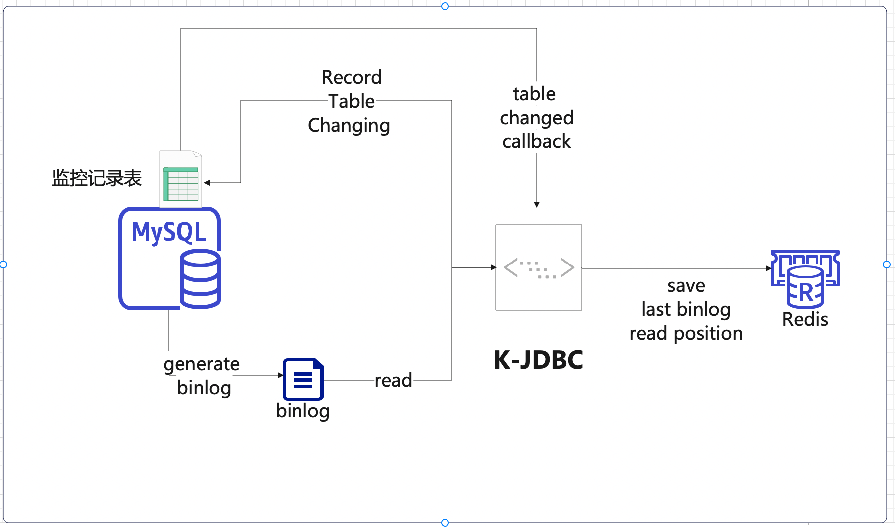
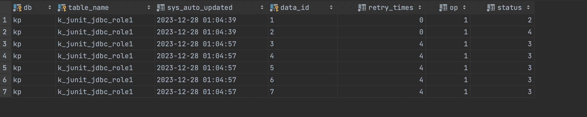

# binlog-table-monitor

### Description

> A table monitoring tool based on binlog connector Java and Redis.。

The implemented functions include:
1. Record changes in the monitoring table to a specific record table
2. Provide callback functions based on changes in the table

### design specification




1. Use the MySQL binlog connector Java toolkit to read the binlog of MySQL

2. Record the read positions in Redis, and on the next startup, read the last position from Redis

3. Changes in the monitored table will be recorded and stored in one or several fixed record tables, with the following table structure:

```
   CREATE TABLE IF NOT EXISTS `k_junit_table_monitor_binlog`
   (
   `db`               varchar(64) NOT NULL COMMENT 'database',
   `table_name`       varchar(64) NOT NULL COMMENT 'table-name',
   `sys_auto_updated` datetime    NOT NULL DEFAULT CURRENT_TIMESTAMP ON UPDATE CURRENT_TIMESTAMP COMMENT 'sys update time',
   `data_id`          varchar(64) NOT NULL COMMENT 'data_id',
   `retry_times`      tinyint     NOT NULL DEFAULT 0 COMMENT 'retry times',
   `op`               tinyint     NOT NULL DEFAULT 0 COMMENT '1、insert 2、update 3、delete',
   `status`           tinyint(4)  NOT NULL DEFAULT 0 COMMENT '0 wait，1 processing，2 success，3、retrying，4、error',
   PRIMARY KEY (`db`, `table_name`, `data_id`)
   );
```

4. The changes in the monitoring table will trigger a callback function, and the user needs to 
    implement the ExecCallback interface themselves


### Installation

#### 1、build and publish to local

```
        gradle clean build publishToMavenLocal-x test
```

####   Dependencies (gradle.org)


```
    // mysql driver
    implementation("mysql:mysql-connector-java")
    // Tool kit for reading binlog
    implementation 'com.zendesk:mysql-binlog-connector-java'
    // Redis driver
    implementation 'io.lettuce:lettuce-core'
    // json for json serialization
    implementation("com.fasterxml.jackson.core:jackson-databind")
    implementation("com.fasterxml.jackson.datatype:jackson-datatype-jsr310")

```


### Instructions

#### Prepare monitoring table before testing


```

CREATE TABLE IF NOT EXISTS `k_junit_jdbc_role1`
(
    `id`                    varchar(64)  NOT NULL COMMENT '主键',
    `sys_tenant_id`         varchar(64)  NOT NULL DEFAULT '' COMMENT '租户ID',
    `sys_auto_updated`      datetime     NOT NULL DEFAULT CURRENT_TIMESTAMP ON UPDATE CURRENT_TIMESTAMP COMMENT '系统更新时间',
    `sys_created_user_id`   varchar(64)  NOT NULL default 0 COMMENT '创建人userid',
    `sys_created_user_name` varchar(64)  NOT NULL default '' COMMENT '创建人username',
    `sys_created_time`      datetime     NOT NULL DEFAULT CURRENT_TIMESTAMP COMMENT '创建时间',
    `sys_update_user_id`    varchar(64)  NOT NULL default 0 COMMENT '最后编辑人userid',
    `sys_update_user_name`  varchar(64)  NOT NULL default '' COMMENT '最后编辑人username',
    `sys_update_time`       datetime     NOT NULL DEFAULT CURRENT_TIMESTAMP COMMENT '最后编辑时间',
    `sys_delete_flag`       tinyint      NOT NULL DEFAULT 0 COMMENT '0 未删除 1删除',
    `sys_op_lock`           int          NULL DEFAULT 0 COMMENT '乐观锁',
    `code`                  varchar(64)  NOT NULL DEFAULT '' COMMENT 'code',
    `name`                  varchar(64)  NOT NULL DEFAULT '' COMMENT 'name',
    `type`                  tinyint      NOT NULL DEFAULT 0 COMMENT '类型',
    `status`                tinyint      NOT NULL DEFAULT 0 COMMENT '角色状态，预留',
    `description`           varchar(255) NOT NULL DEFAULT '' COMMENT '描述',
    PRIMARY KEY (`id`),
    UNIQUE KEY `uniq_role_code` (`code`) COMMENT '唯一的code'
);

CREATE TABLE IF NOT EXISTS `k_junit_jdbc_role2`
(
    `id`                    varchar(64)  NOT NULL COMMENT '主键',
    `sys_tenant_id`         varchar(64)  NOT NULL DEFAULT '' COMMENT '租户ID',
    `sys_auto_updated`      datetime     NOT NULL DEFAULT CURRENT_TIMESTAMP ON UPDATE CURRENT_TIMESTAMP COMMENT '系统更新时间',
    `sys_created_user_id`   varchar(64)  NOT NULL default 0 COMMENT '创建人userid',
    `sys_created_user_name` varchar(64)  NOT NULL default '' COMMENT '创建人username',
    `sys_created_time`      datetime     NOT NULL DEFAULT CURRENT_TIMESTAMP COMMENT '创建时间',
    `sys_update_user_id`    varchar(64)  NOT NULL default 0 COMMENT '最后编辑人userid',
    `sys_update_user_name`  varchar(64)  NOT NULL default '' COMMENT '最后编辑人username',
    `sys_update_time`       datetime     NOT NULL DEFAULT CURRENT_TIMESTAMP COMMENT '最后编辑时间',
    `sys_delete_flag`       tinyint      NOT NULL DEFAULT 0 COMMENT '0 未删除 1删除',
    `sys_op_lock`           int          NULL DEFAULT 0 COMMENT '乐观锁',
    `code`                  varchar(64)  NOT NULL DEFAULT '' COMMENT 'code',
    `name`                  varchar(64)  NOT NULL DEFAULT '' COMMENT 'name',
    `type`                  tinyint      NOT NULL DEFAULT 0 COMMENT '类型',
    `status`                tinyint      NOT NULL DEFAULT 0 COMMENT '角色状态，预留',
    `description`           varchar(255) NOT NULL DEFAULT '' COMMENT '描述',
    PRIMARY KEY (`id`),
    UNIQUE KEY `uniq_role_code` (`code`) COMMENT '唯一的code'
);


INSERT INTO k_junit_jdbc_role1 (id, sys_tenant_id, sys_auto_updated, sys_created_user_id,sys_created_user_name, sys_created_time, sys_update_user_id, sys_update_user_name, sys_update_time, sys_delete_flag, sys_op_lock, code, name, type, status, description) VALUES ('1', '', '2023-12-09 15:21:02', '0', '', '2023-12-09 15:19:45', '0', '', '2023-12-09 15:19:45', 0, 0, '1', '1', 0, 0, '');
INSERT INTO k_junit_jdbc_role1 (id, sys_tenant_id, sys_auto_updated, sys_created_user_id,sys_created_user_name, sys_created_time, sys_update_user_id, sys_update_user_name, sys_update_time, sys_delete_flag, sys_op_lock, code, name, type, status, description) VALUES ('2', '', '2023-12-09 15:21:02', '0', '', '2023-12-09 15:21:02', '0', '', '2023-12-09 15:21:02', 0, 0, '2', '2', 0, 0, '');
INSERT INTO k_junit_jdbc_role1 (id, sys_tenant_id, sys_auto_updated, sys_created_user_id,sys_created_user_name, sys_created_time, sys_update_user_id, sys_update_user_name, sys_update_time, sys_delete_flag, sys_op_lock, code, name, type, status, description) VALUES ('3', '', '2023-12-09 15:21:02', '0', '', '2023-12-09 15:21:02', '0', '', '2023-12-09 15:21:02', 0, 0, '3', '3', 0, 0, '');
INSERT INTO k_junit_jdbc_role1 (id, sys_tenant_id, sys_auto_updated, sys_created_user_id,sys_created_user_name, sys_created_time, sys_update_user_id, sys_update_user_name, sys_update_time, sys_delete_flag, sys_op_lock, code, name, type, status, description) VALUES ('4', '', '2023-12-09 15:21:02', '0', '', '2023-12-09 15:21:02', '0', '', '2023-12-09 15:21:02', 0, 0, '4', '4', 0, 0, '');
INSERT INTO k_junit_jdbc_role1 (id, sys_tenant_id, sys_auto_updated, sys_created_user_id,sys_created_user_name, sys_created_time, sys_update_user_id, sys_update_user_name, sys_update_time, sys_delete_flag, sys_op_lock, code, name, type, status, description) VALUES ('5', '', '2023-12-09 15:21:02', '0', '', '2023-12-09 15:21:02', '0', '', '2023-12-09 15:21:02', 0, 0, '5', '5', 0, 0, '');
INSERT INTO k_junit_jdbc_role1 (id, sys_tenant_id, sys_auto_updated, sys_created_user_id,sys_created_user_name, sys_created_time, sys_update_user_id, sys_update_user_name, sys_update_time, sys_delete_flag, sys_op_lock, code, name, type, status, description) VALUES ('6', '', '2023-12-09 15:21:02', '0', '', '2023-12-09 15:21:02', '0', '', '2023-12-09 15:21:02', 0, 0, '6', '6', 0, 0, '');
INSERT INTO k_junit_jdbc_role1 (id, sys_tenant_id, sys_auto_updated, sys_created_user_id,  sys_created_user_name, sys_created_time, sys_update_user_id, sys_update_user_name, sys_update_time, sys_delete_flag, sys_op_lock, code, name, type, status, description) VALUES ('7', '', '2023-12-09 15:20:02', '0', '', '2023-12-09 15:21:02', '0', '', '2023-12-09 15:21:02', 0, 0, '7', '7', 0, 0, '');


INSERT INTO k_junit_jdbc_role2 (id, sys_tenant_id, sys_auto_updated, sys_created_user_id,sys_created_user_name, sys_created_time, sys_update_user_id, sys_update_user_name, sys_update_time, sys_delete_flag, sys_op_lock, code, name, type, status, description) VALUES ('1', '', '2023-12-09 15:21:02', '0', '', '2023-12-09 15:19:45', '0', '', '2023-12-09 15:19:45', 0, 0, '1', '1', 0, 0, '');
INSERT INTO k_junit_jdbc_role2 (id, sys_tenant_id, sys_auto_updated, sys_created_user_id,sys_created_user_name, sys_created_time, sys_update_user_id, sys_update_user_name, sys_update_time, sys_delete_flag, sys_op_lock, code, name, type, status, description) VALUES ('2', '', '2023-12-09 15:21:02', '0', '', '2023-12-09 15:21:02', '0', '', '2023-12-09 15:21:02', 0, 0, '2', '2', 0, 0, '');
INSERT INTO k_junit_jdbc_role2 (id, sys_tenant_id, sys_auto_updated, sys_created_user_id,sys_created_user_name, sys_created_time, sys_update_user_id, sys_update_user_name, sys_update_time, sys_delete_flag, sys_op_lock, code, name, type, status, description) VALUES ('3', '', '2023-12-09 15:21:02', '0', '', '2023-12-09 15:21:02', '0', '', '2023-12-09 15:21:02', 0, 0, '3', '3', 0, 0, '');
INSERT INTO k_junit_jdbc_role2 (id, sys_tenant_id, sys_auto_updated, sys_created_user_id,sys_created_user_name, sys_created_time, sys_update_user_id, sys_update_user_name, sys_update_time, sys_delete_flag, sys_op_lock, code, name, type, status, description) VALUES ('4', '', '2023-12-09 15:21:02', '0', '', '2023-12-09 15:21:02', '0', '', '2023-12-09 15:21:02', 0, 0, '4', '4', 0, 0, '');
INSERT INTO k_junit_jdbc_role2 (id, sys_tenant_id, sys_auto_updated, sys_created_user_id,sys_created_user_name, sys_created_time, sys_update_user_id, sys_update_user_name, sys_update_time, sys_delete_flag, sys_op_lock, code, name, type, status, description) VALUES ('5', '', '2023-12-09 15:21:02', '0', '', '2023-12-09 15:21:02', '0', '', '2023-12-09 15:21:02', 0, 0, '5', '5', 0, 0, '');
INSERT INTO k_junit_jdbc_role2 (id, sys_tenant_id, sys_auto_updated, sys_created_user_id,sys_created_user_name, sys_created_time, sys_update_user_id, sys_update_user_name, sys_update_time, sys_delete_flag, sys_op_lock, code, name, type, status, description) VALUES ('6', '', '2023-12-09 15:21:02', '0', '', '2023-12-09 15:21:02', '0', '', '2023-12-09 15:21:02', 0, 0, '6', '6', 0, 0, '');
INSERT INTO k_junit_jdbc_role2 (id, sys_tenant_id, sys_auto_updated, sys_created_user_id,sys_created_user_name, sys_created_time, sys_update_user_id, sys_update_user_name, sys_update_time, sys_delete_flag, sys_op_lock, code, name, type, status, description) VALUES ('7', '', '2023-12-09 15:20:02', '0', '', '2023-12-09 15:21:02', '0', '', '2023-12-09 15:21:02', 0, 0, '7', '7', 0, 0, '');


```
#### sample code

```java
package io.github.kylinhunter.jdbc;

import io.github.kylinhunter.commons.jdbc.binlog.bean.BinConfig;
import io.github.kylinhunter.commons.jdbc.binlog.savepoint.imp.RedisSavePointManager;
import io.github.kylinhunter.commons.jdbc.binlog.savepoint.redis.RedisConfig;
import io.github.kylinhunter.commons.jdbc.binlog.savepoint.redis.RedisExecutor;
import io.github.kylinhunter.commons.jdbc.monitor.TableMonitor;
import io.github.kylinhunter.commons.jdbc.monitor.binlog.BinTableMonitor;
import io.github.kylinhunter.commons.jdbc.monitor.binlog.bean.BinMonitorConfig;
import io.github.kylinhunter.commons.jdbc.monitor.binlog.bean.BinTable;
import io.github.kylinhunter.commons.jdbc.monitor.manager.TableTaskManager;
import io.github.kylinhunter.commons.jdbc.monitor.manager.dao.entity.TableMonitorTask;
import io.github.kylinhunter.commons.jdbc.monitor.task.RowListener;
import lombok.extern.slf4j.Slf4j;

class TestBinLogTableMonitor {
  /**
   * Obtain RedisSavePointManager instance as a temporary storage point for storing binlog records
   *
   * @return RedisSavePointManager instance
   */
  public static RedisSavePointManager getRedisSavePointManager() {
    RedisConfig redisConfig = new RedisConfig();
    redisConfig.setHost("127.0.0.1");
    redisConfig.setPort(6379);
    redisConfig.setPassword("123456");
    RedisExecutor redisExecutor = new RedisExecutor(redisConfig);
    return new RedisSavePointManager(redisExecutor);
  }
  /**
   * Get BinConfiguration object for reading binlog
   *
   * @return BinConfiguration returns a BinConfiguration object
   */
  public static BinConfig getBinLogConfig() {
    BinConfig binConfig = new BinConfig();
    binConfig.setBinlogFilename("binlog.000047"); // Specify the binlog file name
    binConfig.setBinlogPosition(0); // Specify the starting position of the binlog file
    binConfig.setUrl("jdbc:mysql://localhost:3306/kp?useUnicode=true&characterEncoding=utf8&useSSL=false&allowPublicKeyRetrieval=true&allowMultiQueries=true&serverTimezone=Asia/Shanghai");
    binConfig.setUsername("root");
    binConfig.setPassword("root");
    binConfig.setSavePointManager(getRedisSavePointManager());

    return binConfig;
  }

  /**
   * Obtain BinMonitor Configuration instance to specify the tables that need to be monitored
   *
   * @return BinMonitorConfig instance
   */
  public static BinMonitorConfig getBinMonitorConfig() {
    BinMonitorConfig monitorConfig = new BinMonitorConfig();

    BinTable binTable = new BinTable(); 
    binTable.setPkColName("id"); // primary key 's column name
    binTable.setDatabase("kp"); // database 
    binTable.setTableName("k_junit_jdbc_role1"); // the be monitored table
    binTable.setDestination("k_junit_table_monitor_binlog");

    monitorConfig.add(binTable);
    // monitorConfig.add(binTable2); Supports multiple tables
    return monitorConfig;
  }


  /**
   * Callback logic for monitoring tables
   */

  @Slf4j
  public static class TestRowListener implements ExecCallback {
    /**
     * @param database  database
     * @param tableName tableName
     * @param dataId    dataId
     * @title insert
     * @description insert
     * @author BiJi'an
     * @date 2023-12-28 17:08
     */
    @Override
    public void insert(String database, String tableName, String dataId) {
      log.info("inser to database:{},tableName:{},dataId:{}", database, tableName, dataId);
      // 模拟业务处理
      if (dataId.equals("1")) {
        log.info("mock data1  insert event ,success 。。。。。。");
      } else if (dataId.equals("2")) {
        throw new FastFailException("mock fast fail 。。。。。。");
      } else {
        throw new RuntimeException("mock other fail  , retry 3 times....");
      }
    }

    /**
     * @param database  database
     * @param tableName tableName
     * @param dataId    dataId
     * @title update
     * @description update
     * @author BiJi'an
     * @date 2023-12-28 17:08
     */
    @Override
    public void update(String database, String tableName, String dataId) {
      log.info("update to database:{},tableName:{},dataId:{}", database, tableName, dataId);
      // 模拟业务处理
      if (dataId.equals("1")) {
        log.info("mock data1  insert event ,success 。。。。。。");
      } else if (dataId.equals("2")) {
        throw new FastFailException("mock fast fail 。。。。。。");
      } else {
        throw new RuntimeException("mock other fail  , retry 3 times....");
      }
    }

    /**
     * @param database  database
     * @param tableName tableName
     * @param dataId    dataId
     * @title delete
     * @description delete
     * @author BiJi'an
     * @date 2023-12-28 17:08
     */
    @Override
    public void delete(String database, String tableName, String dataId) {
      log.info("delete to database:{},tableName:{},dataId:{}", database, tableName, dataId);
      // 模拟业务处理
      if (dataId.equals("1")) {
        log.info("mock data1  delete event ,success 。。。。。。");
      } else if (dataId.equals("2")) {
        throw new FastFailException("mock fast fail 。。。。。。");
      } else {
        throw new RuntimeException("mock other fail  , retry 3 times....");
      }
    }
  }


  /**
   *  test entry
   */

  public static void main(String[] args) {
    TableMonitor tableMonitor = new BinTableMonitor(getBinLogConfig(), getBinMonitorConfig());
    //tableMonitor.reset(); // Reset the temporary save point. If you need to reread the binlog,you need to call this method
    tableMonitor.setRowListener(new TestRowListener()); // set callback
    tableMonitor.start(); // start
  }
}

```

#### result
```
  SELECT t.* FROM kp.k_junit_table_monitor_binlog t 
```


### copyright | License

[Apache License 2.0](https://www.apache.org/licenses/LICENSE-2.0)
