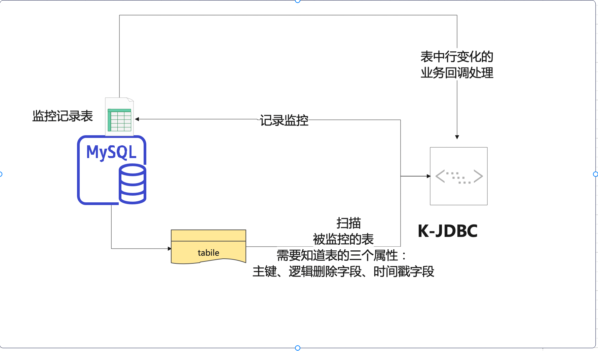
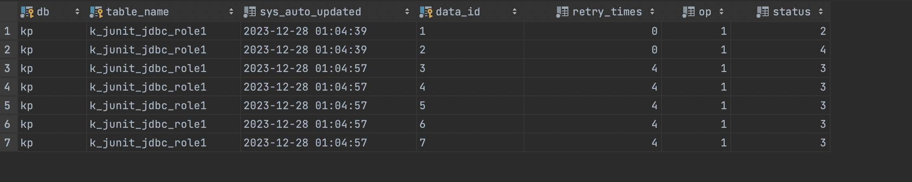

# scan-table-monitor

### Description

> A table monitoring tool based on binlog connector Java and Redis.。

The implemented functions include:
1. Record changes in the monitoring table to a specific record table
2. Provide callback functions based on changes in the table

### design specification




1. Scan the table based on changes in its timestamp
2. Support adding and modifying rows in the scanning table
3. Physical deletion of rows is not supported, but logical deletion is supported.
   It is necessary to specify the fields for logical deletion
4. The changes in the monitored table will be recorded and 
   stored in one or several fixed record tables, with the following table structure:
```
   CREATE TABLE IF NOT EXISTS `k_junit_table_monitor_binlog`
   (
   `db`               varchar(64) NOT NULL COMMENT 'database',
   `table_name`       varchar(64) NOT NULL COMMENT 'table-name',
   `sys_auto_updated` datetime    NOT NULL DEFAULT CURRENT_TIMESTAMP ON UPDATE CURRENT_TIMESTAMP COMMENT 'sys update time',
   `data_id`          varchar(64) NOT NULL COMMENT 'data_id',
   `retry_times`      tinyint     NOT NULL DEFAULT 0 COMMENT 'retry times',
   `op`               tinyint     NOT NULL DEFAULT 0 COMMENT '1、insert 2、update 3、delete',
   `status`           tinyint(4)  NOT NULL DEFAULT 0 COMMENT '0 wait，1 processing，2 success，3、retrying，4、error',
   PRIMARY KEY (`db`, `table_name`, `data_id`)
   );
```

4. The changes in the monitoring table will trigger a callback function, and the user needs to 
    implement the ExecCallback interface themselves


### Instructions

#### Prepare monitoring table before testing


```

CREATE TABLE IF NOT EXISTS `k_junit_jdbc_role1`
(
    `id`                    varchar(64)  NOT NULL COMMENT '主键',
    `sys_tenant_id`         varchar(64)  NOT NULL DEFAULT '' COMMENT '租户ID',
    `sys_auto_updated`      datetime     NOT NULL DEFAULT CURRENT_TIMESTAMP ON UPDATE CURRENT_TIMESTAMP COMMENT '系统更新时间',
    `sys_created_user_id`   varchar(64)  NOT NULL default 0 COMMENT '创建人userid',
    `sys_created_user_name` varchar(64)  NOT NULL default '' COMMENT '创建人username',
    `sys_created_time`      datetime     NOT NULL DEFAULT CURRENT_TIMESTAMP COMMENT '创建时间',
    `sys_update_user_id`    varchar(64)  NOT NULL default 0 COMMENT '最后编辑人userid',
    `sys_update_user_name`  varchar(64)  NOT NULL default '' COMMENT '最后编辑人username',
    `sys_update_time`       datetime     NOT NULL DEFAULT CURRENT_TIMESTAMP COMMENT '最后编辑时间',
    `sys_delete_flag`       tinyint      NOT NULL DEFAULT 0 COMMENT '0 未删除 1删除',
    `sys_op_lock`           int          NULL DEFAULT 0 COMMENT '乐观锁',
    `code`                  varchar(64)  NOT NULL DEFAULT '' COMMENT 'code',
    `name`                  varchar(64)  NOT NULL DEFAULT '' COMMENT 'name',
    `type`                  tinyint      NOT NULL DEFAULT 0 COMMENT '类型',
    `status`                tinyint      NOT NULL DEFAULT 0 COMMENT '角色状态，预留',
    `description`           varchar(255) NOT NULL DEFAULT '' COMMENT '描述',
    PRIMARY KEY (`id`),
    UNIQUE KEY `uniq_role_code` (`code`) COMMENT '唯一的code'
);

CREATE TABLE IF NOT EXISTS `k_junit_jdbc_role2`
(
    `id`                    varchar(64)  NOT NULL COMMENT '主键',
    `sys_tenant_id`         varchar(64)  NOT NULL DEFAULT '' COMMENT '租户ID',
    `sys_auto_updated`      datetime     NOT NULL DEFAULT CURRENT_TIMESTAMP ON UPDATE CURRENT_TIMESTAMP COMMENT '系统更新时间',
    `sys_created_user_id`   varchar(64)  NOT NULL default 0 COMMENT '创建人userid',
    `sys_created_user_name` varchar(64)  NOT NULL default '' COMMENT '创建人username',
    `sys_created_time`      datetime     NOT NULL DEFAULT CURRENT_TIMESTAMP COMMENT '创建时间',
    `sys_update_user_id`    varchar(64)  NOT NULL default 0 COMMENT '最后编辑人userid',
    `sys_update_user_name`  varchar(64)  NOT NULL default '' COMMENT '最后编辑人username',
    `sys_update_time`       datetime     NOT NULL DEFAULT CURRENT_TIMESTAMP COMMENT '最后编辑时间',
    `sys_delete_flag`       tinyint      NOT NULL DEFAULT 0 COMMENT '0 未删除 1删除',
    `sys_op_lock`           int          NULL DEFAULT 0 COMMENT '乐观锁',
    `code`                  varchar(64)  NOT NULL DEFAULT '' COMMENT 'code',
    `name`                  varchar(64)  NOT NULL DEFAULT '' COMMENT 'name',
    `type`                  tinyint      NOT NULL DEFAULT 0 COMMENT '类型',
    `status`                tinyint      NOT NULL DEFAULT 0 COMMENT '角色状态，预留',
    `description`           varchar(255) NOT NULL DEFAULT '' COMMENT '描述',
    PRIMARY KEY (`id`),
    UNIQUE KEY `uniq_role_code` (`code`) COMMENT '唯一的code'
);


INSERT INTO k_junit_jdbc_role1 (id, sys_tenant_id, sys_auto_updated, sys_created_user_id,sys_created_user_name, sys_created_time, sys_update_user_id, sys_update_user_name, sys_update_time, sys_delete_flag, sys_op_lock, code, name, type, status, description) VALUES ('1', '', '2023-12-09 15:21:02', '0', '', '2023-12-09 15:19:45', '0', '', '2023-12-09 15:19:45', 0, 0, '1', '1', 0, 0, '');
INSERT INTO k_junit_jdbc_role1 (id, sys_tenant_id, sys_auto_updated, sys_created_user_id,sys_created_user_name, sys_created_time, sys_update_user_id, sys_update_user_name, sys_update_time, sys_delete_flag, sys_op_lock, code, name, type, status, description) VALUES ('2', '', '2023-12-09 15:21:02', '0', '', '2023-12-09 15:21:02', '0', '', '2023-12-09 15:21:02', 0, 0, '2', '2', 0, 0, '');
INSERT INTO k_junit_jdbc_role1 (id, sys_tenant_id, sys_auto_updated, sys_created_user_id,sys_created_user_name, sys_created_time, sys_update_user_id, sys_update_user_name, sys_update_time, sys_delete_flag, sys_op_lock, code, name, type, status, description) VALUES ('3', '', '2023-12-09 15:21:02', '0', '', '2023-12-09 15:21:02', '0', '', '2023-12-09 15:21:02', 0, 0, '3', '3', 0, 0, '');
INSERT INTO k_junit_jdbc_role1 (id, sys_tenant_id, sys_auto_updated, sys_created_user_id,sys_created_user_name, sys_created_time, sys_update_user_id, sys_update_user_name, sys_update_time, sys_delete_flag, sys_op_lock, code, name, type, status, description) VALUES ('4', '', '2023-12-09 15:21:02', '0', '', '2023-12-09 15:21:02', '0', '', '2023-12-09 15:21:02', 0, 0, '4', '4', 0, 0, '');
INSERT INTO k_junit_jdbc_role1 (id, sys_tenant_id, sys_auto_updated, sys_created_user_id,sys_created_user_name, sys_created_time, sys_update_user_id, sys_update_user_name, sys_update_time, sys_delete_flag, sys_op_lock, code, name, type, status, description) VALUES ('5', '', '2023-12-09 15:21:02', '0', '', '2023-12-09 15:21:02', '0', '', '2023-12-09 15:21:02', 0, 0, '5', '5', 0, 0, '');
INSERT INTO k_junit_jdbc_role1 (id, sys_tenant_id, sys_auto_updated, sys_created_user_id,sys_created_user_name, sys_created_time, sys_update_user_id, sys_update_user_name, sys_update_time, sys_delete_flag, sys_op_lock, code, name, type, status, description) VALUES ('6', '', '2023-12-09 15:21:02', '0', '', '2023-12-09 15:21:02', '0', '', '2023-12-09 15:21:02', 0, 0, '6', '6', 0, 0, '');
INSERT INTO k_junit_jdbc_role1 (id, sys_tenant_id, sys_auto_updated, sys_created_user_id,  sys_created_user_name, sys_created_time, sys_update_user_id, sys_update_user_name, sys_update_time, sys_delete_flag, sys_op_lock, code, name, type, status, description) VALUES ('7', '', '2023-12-09 15:20:02', '0', '', '2023-12-09 15:21:02', '0', '', '2023-12-09 15:21:02', 0, 0, '7', '7', 0, 0, '');


INSERT INTO k_junit_jdbc_role2 (id, sys_tenant_id, sys_auto_updated, sys_created_user_id,sys_created_user_name, sys_created_time, sys_update_user_id, sys_update_user_name, sys_update_time, sys_delete_flag, sys_op_lock, code, name, type, status, description) VALUES ('1', '', '2023-12-09 15:21:02', '0', '', '2023-12-09 15:19:45', '0', '', '2023-12-09 15:19:45', 0, 0, '1', '1', 0, 0, '');
INSERT INTO k_junit_jdbc_role2 (id, sys_tenant_id, sys_auto_updated, sys_created_user_id,sys_created_user_name, sys_created_time, sys_update_user_id, sys_update_user_name, sys_update_time, sys_delete_flag, sys_op_lock, code, name, type, status, description) VALUES ('2', '', '2023-12-09 15:21:02', '0', '', '2023-12-09 15:21:02', '0', '', '2023-12-09 15:21:02', 0, 0, '2', '2', 0, 0, '');
INSERT INTO k_junit_jdbc_role2 (id, sys_tenant_id, sys_auto_updated, sys_created_user_id,sys_created_user_name, sys_created_time, sys_update_user_id, sys_update_user_name, sys_update_time, sys_delete_flag, sys_op_lock, code, name, type, status, description) VALUES ('3', '', '2023-12-09 15:21:02', '0', '', '2023-12-09 15:21:02', '0', '', '2023-12-09 15:21:02', 0, 0, '3', '3', 0, 0, '');
INSERT INTO k_junit_jdbc_role2 (id, sys_tenant_id, sys_auto_updated, sys_created_user_id,sys_created_user_name, sys_created_time, sys_update_user_id, sys_update_user_name, sys_update_time, sys_delete_flag, sys_op_lock, code, name, type, status, description) VALUES ('4', '', '2023-12-09 15:21:02', '0', '', '2023-12-09 15:21:02', '0', '', '2023-12-09 15:21:02', 0, 0, '4', '4', 0, 0, '');
INSERT INTO k_junit_jdbc_role2 (id, sys_tenant_id, sys_auto_updated, sys_created_user_id,sys_created_user_name, sys_created_time, sys_update_user_id, sys_update_user_name, sys_update_time, sys_delete_flag, sys_op_lock, code, name, type, status, description) VALUES ('5', '', '2023-12-09 15:21:02', '0', '', '2023-12-09 15:21:02', '0', '', '2023-12-09 15:21:02', 0, 0, '5', '5', 0, 0, '');
INSERT INTO k_junit_jdbc_role2 (id, sys_tenant_id, sys_auto_updated, sys_created_user_id,sys_created_user_name, sys_created_time, sys_update_user_id, sys_update_user_name, sys_update_time, sys_delete_flag, sys_op_lock, code, name, type, status, description) VALUES ('6', '', '2023-12-09 15:21:02', '0', '', '2023-12-09 15:21:02', '0', '', '2023-12-09 15:21:02', 0, 0, '6', '6', 0, 0, '');
INSERT INTO k_junit_jdbc_role2 (id, sys_tenant_id, sys_auto_updated, sys_created_user_id,sys_created_user_name, sys_created_time, sys_update_user_id, sys_update_user_name, sys_update_time, sys_delete_flag, sys_op_lock, code, name, type, status, description) VALUES ('7', '', '2023-12-09 15:20:02', '0', '', '2023-12-09 15:21:02', '0', '', '2023-12-09 15:21:02', 0, 0, '7', '7', 0, 0, '');


```
#### sample code

```java

package io.github.kylinhunter.jdbc;

import io.github.kylinhunter.commons.jdbc.datasource.DataSourceManager;
import io.github.kylinhunter.commons.jdbc.exception.FastFailException;
import io.github.kylinhunter.commons.jdbc.monitor.TableMonitor;
import io.github.kylinhunter.commons.jdbc.monitor.bean.Table;
import io.github.kylinhunter.commons.jdbc.monitor.scan.ScanTableMonitor;
import io.github.kylinhunter.commons.jdbc.monitor.scan.bean.ScanTable;
import io.github.kylinhunter.commons.jdbc.monitor.scan.bean.TableScanConfig;
import io.github.kylinhunter.commons.jdbc.monitor.task.AbstractRowListener;
import javax.sql.DataSource;
import lombok.extern.slf4j.Slf4j;

class TestScanTableMonitorEn {

   /**
    * Get TableScanConfiguration object for configuring scanning listeners
    *
    * @return TableScanConfig对象
    */
   public static TableScanConfig getTablescanConfig() {
      TableScanConfig tableScanConfig = new TableScanConfig();
      tableScanConfig.setThreadPoolSize(2); // Thread pool size is used to handle listening and retry
      ScanTable scanTable = new ScanTable();  //Create a table config to scan
      scanTable.setDatabase("kp"); // Database to be monitored
      scanTable.setTableName("k_junit_jdbc_role1");  // Table to be monitored
      scanTable.setPkColName("id"); // primary key column name
      scanTable.setTableTimeName("sys_auto_updated"); // The time column name of the monitored table
      scanTable.setDestination(
              "k_junit_table_monitor_scan"); // The storage location of monitoring results can be different for each table
      scanTable.setScanLimit(100); // Number of scans per time
      scanTable.setScanInterval(1000); // Interval between each scan
      tableScanConfig.setMaxRetryTimes(3); // Failed retry count  3
      tableScanConfig.add(scanTable);
      return tableScanConfig;
   }

   /***
    * @title Callback function for testing line changes
    */
   @Slf4j
   public static class TestRowListener extends AbstractRowListener {

      /**
       * @param table  table
       * @param dataId dataId
       * @title insert
       * @description insert
       * @author BiJi'an
       * @date 2023-12-30 17:08
       */
      @Override
      public void insert(Table table, String dataId) {
         log.info("inser to tableName:{},dataId:{}", table.getTableName(), dataId);
         // mock
         if (dataId.equals("1")) {
            log.info("mock data1  insert event ,success 。。。。。。");
         } else if (dataId.equals("2")) {
            throw new FastFailException("mock fast fail 。。。。。。");
         } else {
            throw new RuntimeException("mock other fail  , retry 3 times....");
         }
      }

      /**
       * @param table  table
       * @param dataId dataId
       * @title update
       * @description update
       * @author BiJi'an
       * @date 2023-12-30 17:08
       */
      @Override
      public void update(Table table, String dataId) {
         log.info("update to tableName:{},dataId:{}", table.getTableName(), dataId);
         // 模拟业务处理
         if (dataId.equals("1")) {
            log.info("mock data1  insert event ,success 。。。。。。");
         } else if (dataId.equals("2")) {
            throw new FastFailException("mock fast fail 。。。。。。");
         } else {
            throw new RuntimeException("mock other fail  , retry 3 times....");
         }
      }

      /**
       * @param table  table
       * @param dataId dataId
       * @title delete
       * @description delete
       * @author BiJi'an
       * @date 2023-12-30 17:08
       */
      @Override
      public void delete(Table table, String dataId) {
         log.info("delete to tableName:{},dataId:{}", table.getTableName(), dataId);
         // 模拟业务处理
         if (dataId.equals("1")) {
            log.info("mock data1  delete event ,success 。。。。。。");
         } else if (dataId.equals("2")) {
            throw new FastFailException("mock fast fail 。。。。。。");
         } else {
            throw new RuntimeException("mock other fail  , retry 3 times....");
         }
      }
   }


   /**
    * 测试入口
    */

   public static void main(String[] args) {

      DataSource dataSource = new DataSourceManager(true).get(); // any database
      TableMonitor tableMonitor = new ScanTableMonitor(dataSource, getTablescanConfig());
      tableMonitor.reset(); // Reset scanning, for repeat listening, default Do not call
      tableMonitor.setRowListener(new TestRowListener()); // Registry Row Listener
      tableMonitor.start();
   }
}

```

#### result
```
  // show the result
  SELECT t.* FROM kp.k_junit_table_monitor_binlog t 
```


> Observing the above picture, it can be seen that

1. table j_junit_jdbc_role1 row （1）    The user received the  event and processed it successfully. 
   Status=2
2. table j_junit_jdbc_role1 row （2）    The user received the  event and  gave up processing, 
   setting it to fail status=4
3. table j_junit_jdbc_role1 row （3-7）  The user received the  event and was unable to process it 
   successfully. After four retries, the final failure was status=4


### copyright | License

[Apache License 2.0](https://www.apache.org/licenses/LICENSE-2.0)
