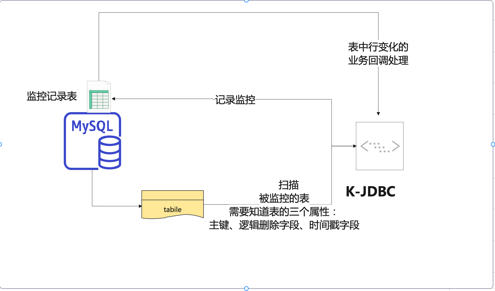
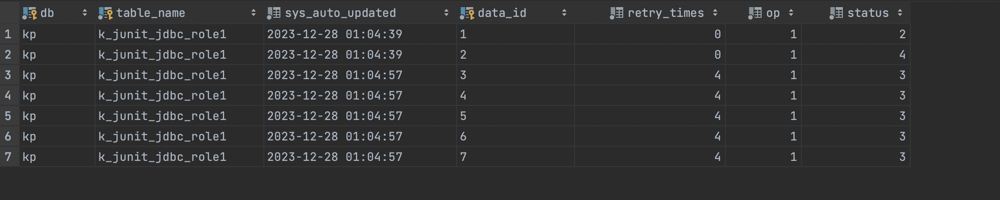

# binlog-table-monitor

### 介绍

> 一个基于时间戳变化的表监控工具。

实现的功能包括:
1. 监控表的变化记录到特定记录表中
2. 根据表的变化，提供回调函数


### 设计说明



1. 根据表时间戳的变化，扫描表
2. 支持扫描表中行的新增和修改
3. 不支持行的物理删除，但是支持逻辑删除，需要指定逻辑删除额自动
4. 被监控的表的变化，会被记录存储在一个或者几个固定的记录表中，表结构如下：

```
   CREATE TABLE IF NOT EXISTS `k_junit_table_monitor_binlog`
   (
   `db`               varchar(64) NOT NULL COMMENT 'database',
   `table_name`       varchar(64) NOT NULL COMMENT 'table-name',
   `sys_auto_updated` datetime    NOT NULL DEFAULT CURRENT_TIMESTAMP ON UPDATE CURRENT_TIMESTAMP COMMENT 'sys update time',
   `data_id`          varchar(64) NOT NULL COMMENT 'data_id',
   `retry_times`      tinyint     NOT NULL DEFAULT 0 COMMENT 'retry times',
   `op`               tinyint     NOT NULL DEFAULT 0 COMMENT '1、insert 2、update 3、delete',
   `status`           tinyint(4)  NOT NULL DEFAULT 0 COMMENT '0 wait，1 processing，2 success，3、retrying，4、error',
   PRIMARY KEY (`db`, `table_name`, `data_id`)
   );
```

4. 监控表的变化，会触发回调函数，需要用户自己实现 ExecCallback 接口


### 使用说明

#### 测试前准备监控的表

```

CREATE TABLE IF NOT EXISTS `k_junit_jdbc_role1`
(
    `id`                    varchar(64)  NOT NULL COMMENT '主键',
    `sys_tenant_id`         varchar(64)  NOT NULL DEFAULT '' COMMENT '租户ID',
    `sys_auto_updated`      datetime     NOT NULL DEFAULT CURRENT_TIMESTAMP ON UPDATE CURRENT_TIMESTAMP COMMENT '系统更新时间',
    `sys_created_user_id`   varchar(64)  NOT NULL default 0 COMMENT '创建人userid',
    `sys_created_user_name` varchar(64)  NOT NULL default '' COMMENT '创建人username',
    `sys_created_time`      datetime     NOT NULL DEFAULT CURRENT_TIMESTAMP COMMENT '创建时间',
    `sys_update_user_id`    varchar(64)  NOT NULL default 0 COMMENT '最后编辑人userid',
    `sys_update_user_name`  varchar(64)  NOT NULL default '' COMMENT '最后编辑人username',
    `sys_update_time`       datetime     NOT NULL DEFAULT CURRENT_TIMESTAMP COMMENT '最后编辑时间',
    `sys_delete_flag`       tinyint      NOT NULL DEFAULT 0 COMMENT '0 未删除 1删除',
    `sys_op_lock`           int          NULL DEFAULT 0 COMMENT '乐观锁',
    `code`                  varchar(64)  NOT NULL DEFAULT '' COMMENT 'code',
    `name`                  varchar(64)  NOT NULL DEFAULT '' COMMENT 'name',
    `type`                  tinyint      NOT NULL DEFAULT 0 COMMENT '类型',
    `status`                tinyint      NOT NULL DEFAULT 0 COMMENT '角色状态，预留',
    `description`           varchar(255) NOT NULL DEFAULT '' COMMENT '描述',
    PRIMARY KEY (`id`),
    UNIQUE KEY `uniq_role_code` (`code`) COMMENT '唯一的code'
);

CREATE TABLE IF NOT EXISTS `k_junit_jdbc_role2`
(
    `id`                    varchar(64)  NOT NULL COMMENT '主键',
    `sys_tenant_id`         varchar(64)  NOT NULL DEFAULT '' COMMENT '租户ID',
    `sys_auto_updated`      datetime     NOT NULL DEFAULT CURRENT_TIMESTAMP ON UPDATE CURRENT_TIMESTAMP COMMENT '系统更新时间',
    `sys_created_user_id`   varchar(64)  NOT NULL default 0 COMMENT '创建人userid',
    `sys_created_user_name` varchar(64)  NOT NULL default '' COMMENT '创建人username',
    `sys_created_time`      datetime     NOT NULL DEFAULT CURRENT_TIMESTAMP COMMENT '创建时间',
    `sys_update_user_id`    varchar(64)  NOT NULL default 0 COMMENT '最后编辑人userid',
    `sys_update_user_name`  varchar(64)  NOT NULL default '' COMMENT '最后编辑人username',
    `sys_update_time`       datetime     NOT NULL DEFAULT CURRENT_TIMESTAMP COMMENT '最后编辑时间',
    `sys_delete_flag`       tinyint      NOT NULL DEFAULT 0 COMMENT '0 未删除 1删除',
    `sys_op_lock`           int          NULL DEFAULT 0 COMMENT '乐观锁',
    `code`                  varchar(64)  NOT NULL DEFAULT '' COMMENT 'code',
    `name`                  varchar(64)  NOT NULL DEFAULT '' COMMENT 'name',
    `type`                  tinyint      NOT NULL DEFAULT 0 COMMENT '类型',
    `status`                tinyint      NOT NULL DEFAULT 0 COMMENT '角色状态，预留',
    `description`           varchar(255) NOT NULL DEFAULT '' COMMENT '描述',
    PRIMARY KEY (`id`),
    UNIQUE KEY `uniq_role_code` (`code`) COMMENT '唯一的code'
);


INSERT INTO k_junit_jdbc_role1 (id, sys_tenant_id, sys_auto_updated, sys_created_user_id,sys_created_user_name, sys_created_time, sys_update_user_id, sys_update_user_name, sys_update_time, sys_delete_flag, sys_op_lock, code, name, type, status, description) VALUES ('1', '', '2023-12-09 15:21:02', '0', '', '2023-12-09 15:19:45', '0', '', '2023-12-09 15:19:45', 0, 0, '1', '1', 0, 0, '');
INSERT INTO k_junit_jdbc_role1 (id, sys_tenant_id, sys_auto_updated, sys_created_user_id,sys_created_user_name, sys_created_time, sys_update_user_id, sys_update_user_name, sys_update_time, sys_delete_flag, sys_op_lock, code, name, type, status, description) VALUES ('2', '', '2023-12-09 15:21:02', '0', '', '2023-12-09 15:21:02', '0', '', '2023-12-09 15:21:02', 0, 0, '2', '2', 0, 0, '');
INSERT INTO k_junit_jdbc_role1 (id, sys_tenant_id, sys_auto_updated, sys_created_user_id,sys_created_user_name, sys_created_time, sys_update_user_id, sys_update_user_name, sys_update_time, sys_delete_flag, sys_op_lock, code, name, type, status, description) VALUES ('3', '', '2023-12-09 15:21:02', '0', '', '2023-12-09 15:21:02', '0', '', '2023-12-09 15:21:02', 0, 0, '3', '3', 0, 0, '');
INSERT INTO k_junit_jdbc_role1 (id, sys_tenant_id, sys_auto_updated, sys_created_user_id,sys_created_user_name, sys_created_time, sys_update_user_id, sys_update_user_name, sys_update_time, sys_delete_flag, sys_op_lock, code, name, type, status, description) VALUES ('4', '', '2023-12-09 15:21:02', '0', '', '2023-12-09 15:21:02', '0', '', '2023-12-09 15:21:02', 0, 0, '4', '4', 0, 0, '');
INSERT INTO k_junit_jdbc_role1 (id, sys_tenant_id, sys_auto_updated, sys_created_user_id,sys_created_user_name, sys_created_time, sys_update_user_id, sys_update_user_name, sys_update_time, sys_delete_flag, sys_op_lock, code, name, type, status, description) VALUES ('5', '', '2023-12-09 15:21:02', '0', '', '2023-12-09 15:21:02', '0', '', '2023-12-09 15:21:02', 0, 0, '5', '5', 0, 0, '');
INSERT INTO k_junit_jdbc_role1 (id, sys_tenant_id, sys_auto_updated, sys_created_user_id,sys_created_user_name, sys_created_time, sys_update_user_id, sys_update_user_name, sys_update_time, sys_delete_flag, sys_op_lock, code, name, type, status, description) VALUES ('6', '', '2023-12-09 15:21:02', '0', '', '2023-12-09 15:21:02', '0', '', '2023-12-09 15:21:02', 0, 0, '6', '6', 0, 0, '');
INSERT INTO k_junit_jdbc_role1 (id, sys_tenant_id, sys_auto_updated, sys_created_user_id,  sys_created_user_name, sys_created_time, sys_update_user_id, sys_update_user_name, sys_update_time, sys_delete_flag, sys_op_lock, code, name, type, status, description) VALUES ('7', '', '2023-12-09 15:20:02', '0', '', '2023-12-09 15:21:02', '0', '', '2023-12-09 15:21:02', 0, 0, '7', '7', 0, 0, '');


INSERT INTO k_junit_jdbc_role2 (id, sys_tenant_id, sys_auto_updated, sys_created_user_id,sys_created_user_name, sys_created_time, sys_update_user_id, sys_update_user_name, sys_update_time, sys_delete_flag, sys_op_lock, code, name, type, status, description) VALUES ('1', '', '2023-12-09 15:21:02', '0', '', '2023-12-09 15:19:45', '0', '', '2023-12-09 15:19:45', 0, 0, '1', '1', 0, 0, '');
INSERT INTO k_junit_jdbc_role2 (id, sys_tenant_id, sys_auto_updated, sys_created_user_id,sys_created_user_name, sys_created_time, sys_update_user_id, sys_update_user_name, sys_update_time, sys_delete_flag, sys_op_lock, code, name, type, status, description) VALUES ('2', '', '2023-12-09 15:21:02', '0', '', '2023-12-09 15:21:02', '0', '', '2023-12-09 15:21:02', 0, 0, '2', '2', 0, 0, '');
INSERT INTO k_junit_jdbc_role2 (id, sys_tenant_id, sys_auto_updated, sys_created_user_id,sys_created_user_name, sys_created_time, sys_update_user_id, sys_update_user_name, sys_update_time, sys_delete_flag, sys_op_lock, code, name, type, status, description) VALUES ('3', '', '2023-12-09 15:21:02', '0', '', '2023-12-09 15:21:02', '0', '', '2023-12-09 15:21:02', 0, 0, '3', '3', 0, 0, '');
INSERT INTO k_junit_jdbc_role2 (id, sys_tenant_id, sys_auto_updated, sys_created_user_id,sys_created_user_name, sys_created_time, sys_update_user_id, sys_update_user_name, sys_update_time, sys_delete_flag, sys_op_lock, code, name, type, status, description) VALUES ('4', '', '2023-12-09 15:21:02', '0', '', '2023-12-09 15:21:02', '0', '', '2023-12-09 15:21:02', 0, 0, '4', '4', 0, 0, '');
INSERT INTO k_junit_jdbc_role2 (id, sys_tenant_id, sys_auto_updated, sys_created_user_id,sys_created_user_name, sys_created_time, sys_update_user_id, sys_update_user_name, sys_update_time, sys_delete_flag, sys_op_lock, code, name, type, status, description) VALUES ('5', '', '2023-12-09 15:21:02', '0', '', '2023-12-09 15:21:02', '0', '', '2023-12-09 15:21:02', 0, 0, '5', '5', 0, 0, '');
INSERT INTO k_junit_jdbc_role2 (id, sys_tenant_id, sys_auto_updated, sys_created_user_id,sys_created_user_name, sys_created_time, sys_update_user_id, sys_update_user_name, sys_update_time, sys_delete_flag, sys_op_lock, code, name, type, status, description) VALUES ('6', '', '2023-12-09 15:21:02', '0', '', '2023-12-09 15:21:02', '0', '', '2023-12-09 15:21:02', 0, 0, '6', '6', 0, 0, '');
INSERT INTO k_junit_jdbc_role2 (id, sys_tenant_id, sys_auto_updated, sys_created_user_id,sys_created_user_name, sys_created_time, sys_update_user_id, sys_update_user_name, sys_update_time, sys_delete_flag, sys_op_lock, code, name, type, status, description) VALUES ('7', '', '2023-12-09 15:20:02', '0', '', '2023-12-09 15:21:02', '0', '', '2023-12-09 15:21:02', 0, 0, '7', '7', 0, 0, '');


```
#### 示例代码
```java
package io.github.kylinhunter.jdbc;

import io.github.kylinhunter.commons.jdbc.datasource.DataSourceManager;
import io.github.kylinhunter.commons.jdbc.exception.FastFailException;
import io.github.kylinhunter.commons.jdbc.monitor.TableMonitor;
import io.github.kylinhunter.commons.jdbc.monitor.bean.Table;
import io.github.kylinhunter.commons.jdbc.monitor.scan.ScanTableMonitor;
import io.github.kylinhunter.commons.jdbc.monitor.scan.bean.ScanTable;
import io.github.kylinhunter.commons.jdbc.monitor.scan.bean.TableScanConfig;
import io.github.kylinhunter.commons.jdbc.monitor.task.AbstractRowListener;
import io.github.kylinhunter.commons.jdbc.monitor.task.AbstractScanRowListener;
import javax.sql.DataSource;
import lombok.extern.slf4j.Slf4j;

class TestScanTableMonitorZh {

  /**
   * 获取TableScanConfig对象，用于配置扫描监听器
   *
   * @return TableScanConfig对象
   */
  public static TableScanConfig getTablescanConfig() {
    TableScanConfig tableScanConfig = new TableScanConfig();
    tableScanConfig.setThreadPoolSize(2); // 线程池大小 用于处理监听和重试
    ScanTable scanTable = new ScanTable();  // 创建一个要扫描的表
    scanTable.setDatabase("kp"); // 要监控的数据库
    scanTable.setTableName("k_junit_jdbc_role1");  // 要监控的表
    scanTable.setPkColName("id"); // 被监控表的主键列名
    scanTable.setTableTimeName("sys_auto_updated"); // 被监控表的时间列名
    scanTable.setDestination("k_junit_table_monitor_scan"); // 监控结果存储位置，每个表可以不一样
    scanTable.setScanLimit(100); // 每次扫描条数
    scanTable.setScanInterval(1000); // 每次扫描间隔时间
    scanTable.setDelColName("sys_delete_flag");
    tableScanConfig.setMaxRetryTimes(3); // 失败重试次数 3
    tableScanConfig.add(scanTable);
    return tableScanConfig;
  }

  /***
   * @title 测试行变化的回调函数
   */
  @Slf4j
  public static class TestRowListener extends AbstractScanRowListener {

    /**
     * @param table  table
     * @param dataId dataId
     * @title insert
     * @description insert
     * @author BiJi'an
     * @date 2023-12-28 17:08
     */
    @Override
    public void insert(Table table, String dataId) {
      log.info("inser to tableName:{},dataId:{}", table.getTableName(), dataId);
      // 模拟业务处理
      if (dataId.equals("1")) {
        log.info("模拟处理  数据1  insert 事件处理 成功 。。。。。。");
      } else if (dataId.equals("2")) {
        throw new FastFailException("模拟处理 数据2  的 insert 事件处理 快速失败 ，不再处理 。。。。。。");
      } else {
        throw new RuntimeException("模拟处理其他数据的 insert 事件，发生失败 ,默认会重试3次....");
      }
    }

    /**
     * @param table  table
     * @param dataId dataId
     * @title update
     * @description update
     * @author BiJi'an
     * @date 2023-12-28 17:08
     */
    @Override
    public void update(Table table, String dataId) {
      log.info("update to tableName:{},dataId:{}", table.getTableName(), dataId);
      // 模拟业务处理
      if (dataId.equals("1")) {
        log.info("模拟处理  数据1  insert 事件处理 成功 。。。。。。");
      } else if (dataId.equals("2")) {
        throw new FastFailException("模拟处理 数据2  的 update 事件处理 快速失败 ，不再处理 。。。。。。");
      } else {
        throw new RuntimeException("模拟处理其他数据的 update 事件，发生失败 ,默认会重试3次....");
      }
    }

    /**
     * @param table  table
     * @param dataId dataId
     * @title delete
     * @description delete
     * @author BiJi'an
     * @date 2023-12-28 17:08
     */
    @Override
    public void delete(Table table, String dataId) {
      log.info("delete to tableName:{},dataId:{}", table.getTableName(), dataId);
      // 模拟业务处理
      if (dataId.equals("1")) {
        log.info("模拟处理  数据1  insert 事件处理 成功 。。。。。。");
      } else if (dataId.equals("2")) {
        throw new FastFailException("模拟处理 数据2  的 update 事件处理 快速失败 ，不再处理 。。。。。。");
      } else {
        throw new RuntimeException("模拟处理其他数据的 delete 事件，发生失败 ,默认会重试3次....");
      }
    }
  }


  /**
   * 测试入口
   */

  public static void main(String[] args) {

    DataSource dataSource = new DataSourceManager(true).get(); // 任意数据源，用户自己实现即可
    TableMonitor tableMonitor = new ScanTableMonitor(dataSource, getTablescanConfig());
    tableMonitor.reset(); // 重置扫描,重复监听，默认不要的
    tableMonitor.setRowListener(new TestRowListener()); // 注册表的行监听器
    tableMonitor.start();
  }
}

```

#### 最终结果
```
 //查看监控记录表中最新状态
  SELECT t.* FROM kp.k_junit_table_monitor_scan t 
```


> 观察上图可以看到，是一个重试3次以后的结果

1. 表j_junit_jdbc_role1的row （1）    用户拿到了相关事件，并且处理成功 status=2
2. 表j_junit_jdbc_role1的row （2）    用户拿到了相关事件，并且主动放弃处理,设置为失败  status=4
3. 表j_junit_jdbc_role1的row （3-7） 用户拿到了相关事件，并且一直处理不成功，重试四次后，最终失败status=4


### 版权 | License

[Apache License 2.0](https://www.apache.org/licenses/LICENSE-2.0)
